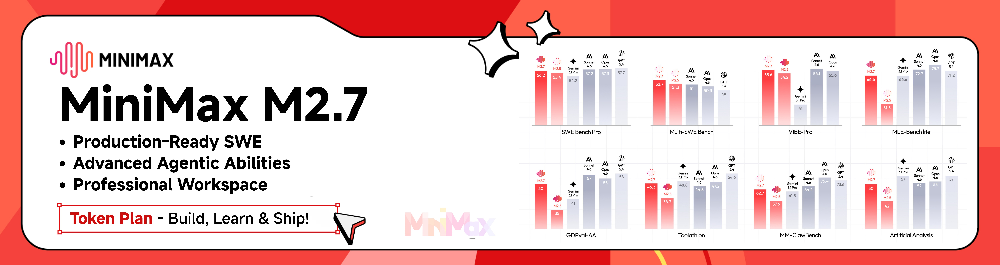
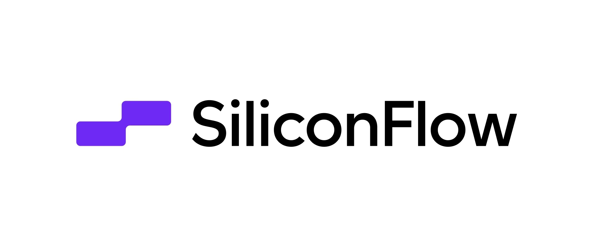
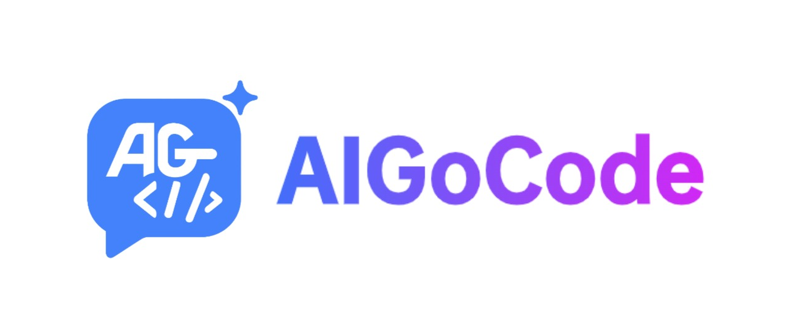
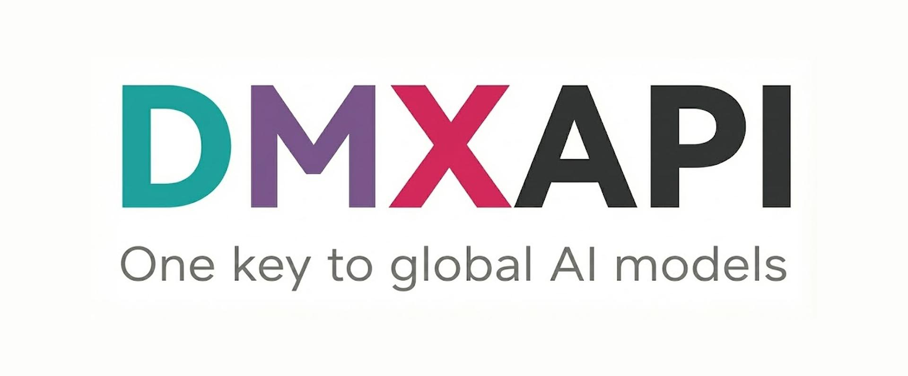
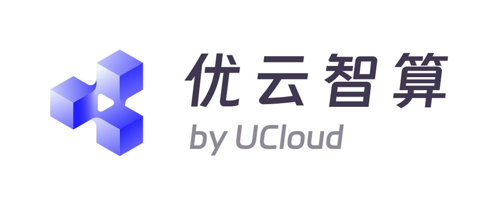
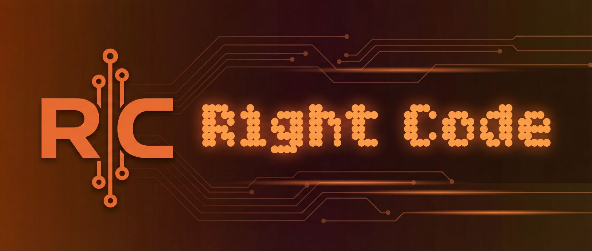
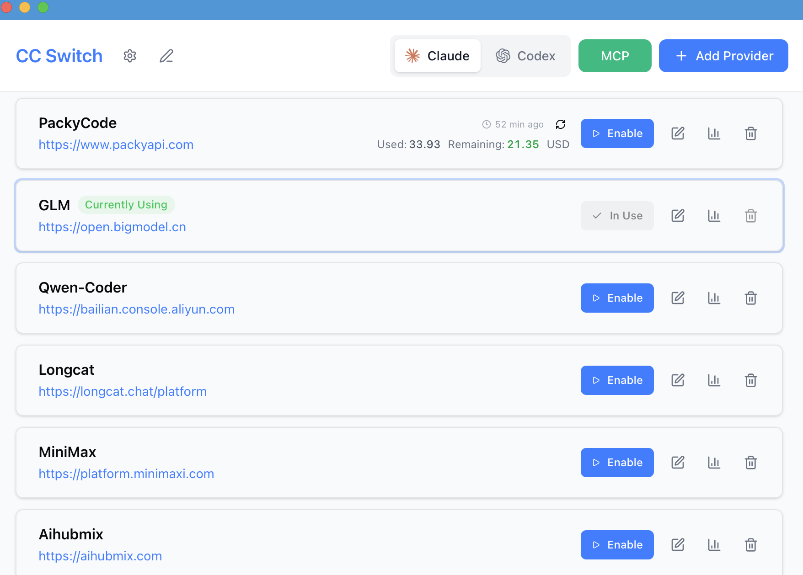
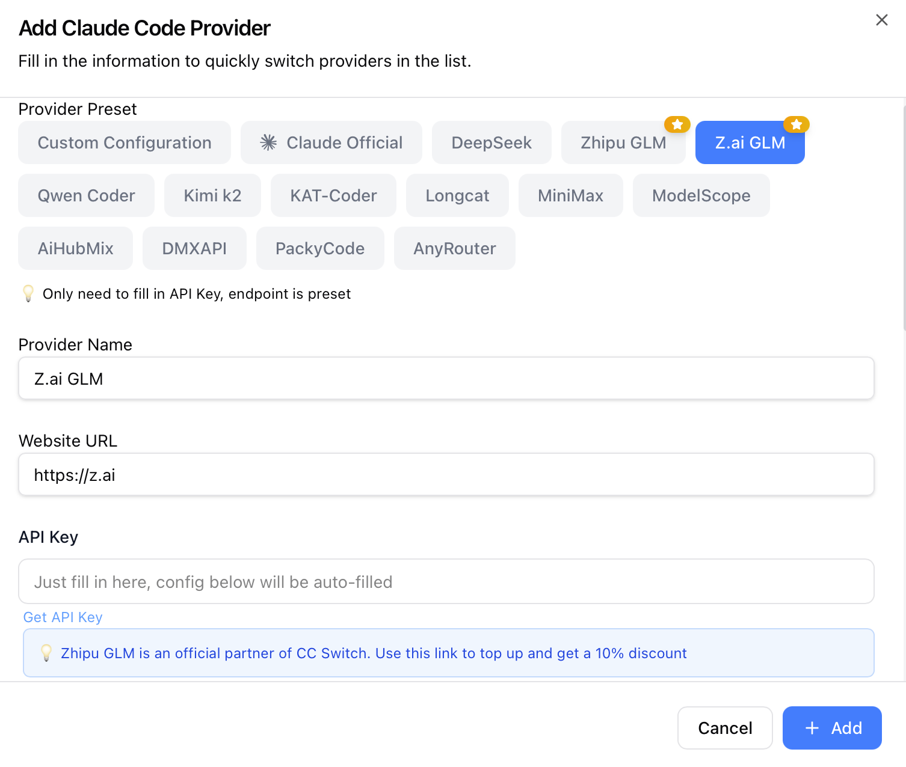

<div align="center">

# CC Switch Legacy

### Compatibility Fork for macOS 10.15 Catalina

[](#compatibility)
[](#compatibility)
[](https://tauri.app/)

English | [Compatibility Notes (ZH)](docs/macos-10.15-compat.md) | [Upstream Project](https://github.com/farion1231/cc-switch) | [Changelog](CHANGELOG.md)

</div>

> [!NOTE]
> **This is the legacy build of CC Switch, maintained for macOS 10.15 (Catalina) compatibility.**
>
> The main CC Switch requires macOS 12 (Monterey) or later due to its dependency on newer system APIs used by Tauri 2. However, many users are still running macOS 10.15 — so this repository provides a legacy build that trades some newer features for broader OS compatibility.
>
> If you are on macOS 12 or later, use the [main release](https://github.com/farion1231/cc-switch) instead for the latest features and updates.

## ❤️Sponsor

> [Want to appear here?](mailto:farion1231@gmail.com)

<details open>
<summary>Click to collapse</summary>

[](https://platform.minimax.io/subscribe/coding-plan?code=ClLhgxr2je&source=link)

MiniMax-M2.7 is a next-generation large language model designed for autonomous evolution and real-world productivity. Unlike traditional models, M2.7 actively participates in its own improvement through agent teams, dynamic tool use, and reinforcement learning loops. It delivers strong performance in software engineering (56.22% on SWE-Pro, 55.6% on VIBE-Pro, 57.0% on Terminal Bench 2) and excels in complex office workflows, achieving a leading 1495 ELO on GDPval-AA. With high-fidelity editing across Word, Excel, and PowerPoint, and a 97% adherence rate across 40+ complex skills, M2.7 sets a new standard for building AI-native workflows and organizations.

[Click](https://platform.minimax.io/subscribe/coding-plan?code=ClLhgxr2je&source=link) to get an exclusive 12% off the MiniMax Token Plan!

---

<table>
<tr>
<td width="180"><a href="https://www.packyapi.com/register?aff=cc-switch"></a></td>
<td>Thanks to PackyCode for sponsoring this project! PackyCode is a reliable and efficient API relay service provider, offering relay services for Claude Code, Codex, Gemini, and more. PackyCode provides special discounts for our software users: register using <a href="https://www.packyapi.com/register?aff=cc-switch">this link</a> and enter the "cc-switch" promo code during first recharge to get 10% off.</td>
</tr>

<tr>
<td width="180"><a href="https://cloud.siliconflow.cn/i/drGuwc9k"></a></td>
<td>Thanks to SiliconFlow for sponsoring this project! SiliconFlow is a high-performance AI infrastructure and model API platform, providing fast and reliable access to language, speech, image, and video models in one place. With pay-as-you-go billing, broad multimodal model support, high-speed inference, and enterprise-grade stability, SiliconFlow helps developers and teams build and scale AI applications more efficiently. Register via <a href="https://cloud.siliconflow.cn/i/drGuwc9k">this link</a> and complete real-name verification to receive ¥20 in bonus credit, usable across models on the platform. SiliconFlow is also now compatible with OpenClaw, allowing users to connect a SiliconFlow API key and call major AI models for free.</td>
</tr>

<tr>
<td width="180"><a href="https://aigocode.com/invite/CC-SWITCH"></a></td>
<td>Thanks to AIGoCode for sponsoring this project! AIGoCode is an all-in-one platform that integrates Claude Code, Codex, and the latest Gemini models, providing you with stable, efficient, and highly cost-effective AI coding services. The platform offers flexible subscription plans, zero risk of account suspension, direct access with no VPN required, and lightning-fast responses. AIGoCode has prepared a special benefit for CC Switch users: if you register via <a href="https://aigocode.com/invite/CC-SWITCH">this link</a>, you'll receive an extra 10% bonus credit on your first top-up!</td>
</tr>

<tr>
<td width="180"><a href="https://www.aicodemirror.com/register?invitecode=9915W3"></a></td>
<td>Thanks to AICodeMirror for sponsoring this project! AICodeMirror provides official high-stability relay services for Claude Code / Codex / Gemini CLI, with enterprise-grade concurrency, fast invoicing, and 24/7 dedicated technical support.
Claude Code / Codex / Gemini official channels at 38% / 2% / 9% of original price, with extra discounts on top-ups! AICodeMirror offers special benefits for CC Switch users: register via <a href="https://www.aicodemirror.com/register?invitecode=9915W3">this link</a> to enjoy 20% off your first top-up, and enterprise customers can get up to 25% off!</td>
</tr>

<tr>
<td width="180"><a href="https://cubence.com/signup?code=CCSWITCH&source=ccs"></a></td>
<td>Thanks to Cubence for sponsoring this project! Cubence is a reliable and efficient API relay service provider, offering relay services for Claude Code, Codex, Gemini, and more with flexible billing options including pay-as-you-go and monthly plans. Cubence provides special discounts for CC Switch users: register using <a href="https://cubence.com/signup?code=CCSWITCH&source=ccs">this link</a> and enter the "CCSWITCH" promo code during recharge to get 10% off every top-up!</td>
</tr>

<tr>
<td width="180"><a href="https://www.dmxapi.cn/register?aff=bUHu"></a></td>
<td>Thanks to DMXAPI for sponsoring this project! DMXAPI provides global large model API services to 200+ enterprise users. One API key for all global models. Features include: instant invoicing, unlimited concurrency, starting from $0.15, 24/7 technical support. GPT/Claude/Gemini all at 32% off, domestic models 20-50% off, Claude Code exclusive models at 66% off! <a href="https://www.dmxapi.cn/register?aff=bUHu">Register here</a></td>
</tr>

<tr>
<td width="180"><a href="https://www.compshare.cn/coding-plan?ytag=GPU_YY_YX_git_cc-switch"></a></td>
<td>Thanks to Compshare for sponsoring this project! Compshare is UCloud's AI cloud platform, providing stable and comprehensive domestic and international model APIs with just one key. Featuring cost-effective monthly and pay-as-you-go Coding Plan packages at 60-80% off official prices. Supports Claude Code, Codex, and API access. Enterprise-grade high concurrency, 24/7 technical support, and self-service invoicing. Users who register via <a href="https://www.compshare.cn/coding-plan?ytag=GPU_YY_YX_git_cc-switch">this link</a> will receive a free 5 CNY platform trial credit!</td>
</tr>

<tr>
<td width="180"><a href="https://www.right.codes/register?aff=CCSWITCH"></a></td>
<td>Thank you to Right Code for sponsoring this project! Right Code reliably provides routing services for models such as Claude Code, Codex, and Gemini. It features a highly cost-effective Codex monthly subscription plan and <strong>supports quota rollovers—unused quota from one day can be carried over and used the next day.</strong> Invoices are available upon top-up. Enterprise and team users can receive dedicated one-on-one support. Right Code also offers an exclusive discount for CC Switch users: register via <a href="https://www.right.codes/register?aff=CCSWITCH">this link</a>, and with every top-up you will receive pay-as-you-go credit equivalent to 25% of the amount paid.</td>
</tr>

This repository is a compatibility-focused fork of [CC Switch](https://github.com/farion1231/cc-switch).

The goal of this fork is simple: keep the original CC Switch experience, while making the desktop app buildable and usable on **macOS 10.15 Catalina**, which is not supported by the upstream project anymore.

If you are on macOS 12+ and do not specifically need Catalina support, the upstream project is still the better default choice.

## What Changed In This Fork

Compared with upstream CC Switch, this fork adds or adjusts the following areas for older macOS compatibility:

- Lowered the macOS deployment target from `12.0` to `10.15`
- Updated Tauri bundle config to allow `macOS 10.15+`
- Added an `objc2` dev-mode workaround for older WebKit protocol methods
- Pinned `esbuild` to `0.21.5` to avoid newer macOS-only symbols
- Lowered frontend build targets for older Safari / WKWebView behavior
- Replaced `smol-toml` with `@iarna/toml` to avoid `BigInt` syntax issues on Safari 13
- Added `MediaQueryList.addListener` fallback for Safari 13 theme change handling

Detailed adaptation notes are documented in [docs/macos-10.15-compat.md](docs/macos-10.15-compat.md).

## Features

This fork keeps the main CC Switch feature set:

- Manage **Claude Code**, **Codex**, **Gemini CLI**, **OpenCode**, and **OpenClaw** in one desktop app
- Import and switch providers without manually editing JSON, TOML, or `.env` files
- Manage **MCP**, **Prompts**, and **Skills** from a unified interface
- Use **system tray quick switching** for fast provider changes
- Track usage and cost data with built-in statistics views
- Sync data through custom config directories or WebDAV
- Browse and restore session history across supported apps

## Screenshots

| Main Interface | Add Provider |
| :---: | :---: |
|  |  |

## Compatibility

### Primary Target

- macOS 10.15 Catalina

### Also Expected To Work

- macOS 11+
- Windows
- Linux

This fork is primarily maintained for Catalina compatibility. Other platforms should remain close to upstream behavior, but Catalina support is the reason this repository exists.

## Quick Start

### Basic Usage

1. **Add Provider**: Click "Add Provider" → Choose a preset or create custom configuration
2. **Switch Provider**:
   - Main UI: Select provider → Click "Enable"
   - System Tray: Click provider name directly (instant effect)
3. **Takes Effect**: Restart your terminal or the corresponding CLI tool to apply changes (Claude Code does not require a restart)
4. **Back to Official**: Add an "Official Login" preset, restart the CLI tool, then follow its login/OAuth flow

### MCP, Prompts, Skills & Sessions

- **MCP**: Click the "MCP" button → Add servers via templates or custom config → Toggle per-app sync
- **Prompts**: Click "Prompts" → Create presets with Markdown editor → Activate to sync to live files
- **Skills**: Click "Skills" → Browse GitHub repos → One-click install to all apps
- **Sessions**: Click "Sessions" → Browse, search, and restore conversation history across all apps

> **Note**: On first launch, you can manually import existing CLI tool configs as the default provider.

## Download & Installation

### System Requirements

- **Windows**: Windows 10 and above
- **macOS**: macOS 10.15 (Catalina) and above
- **Linux**: Ubuntu 22.04+ / Debian 11+ / Fedora 34+ and other mainstream distributions

### Windows Users

1. Add a provider from the main UI
2. Enable the provider you want to use
3. Restart the related CLI tool or terminal if required
4. Use the tray menu for quick switching when needed

### Documentation

- [Compatibility Notes for macOS 10.15](docs/macos-10.15-compat.md)
- [User Manual (English)](docs/user-manual/en/README.md)
- [User Manual (Chinese)](docs/user-manual/zh/README.md)
- [User Manual (Japanese)](docs/user-manual/ja/README.md)

## Build From Source

### Requirements

- Node.js 18+
- pnpm 8+
- Rust 1.85+
- Tauri CLI 2.8+

### Commands

```bash
pnpm install
pnpm dev
pnpm typecheck
pnpm test:unit
pnpm build
```

### Rust Backend

```bash
cd src-tauri
cargo fmt
cargo clippy
cargo test
```

## macOS 10.15 Notes

This fork already includes the key Catalina-related project changes:

- `.cargo/config.toml` sets `MACOSX_DEPLOYMENT_TARGET=10.15`
- `src-tauri/tauri.conf.json` sets `minimumSystemVersion` to `10.15`
- `vite.config.ts` targets older Safari-compatible output
- `package.json` pins `esbuild` to a Catalina-safe version

If you are troubleshooting Catalina-specific issues, start with [docs/macos-10.15-compat.md](docs/macos-10.15-compat.md).

## Project Structure

```text
src/              Frontend (React + TypeScript)
src-tauri/        Backend (Tauri + Rust)
assets/           Screenshots and static assets
docs/             Compatibility notes, manuals, and release notes
tests/            Frontend tests
```

## Acknowledgements

- Original project: [farion1231/cc-switch](https://github.com/farion1231/cc-switch)
- This repository is a compatibility fork, not the official upstream release channel

## License

This project continues to use the [MIT License](LICENSE).
