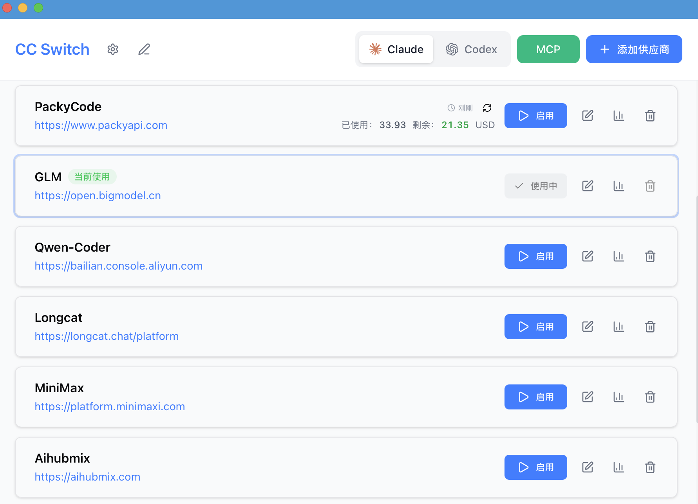
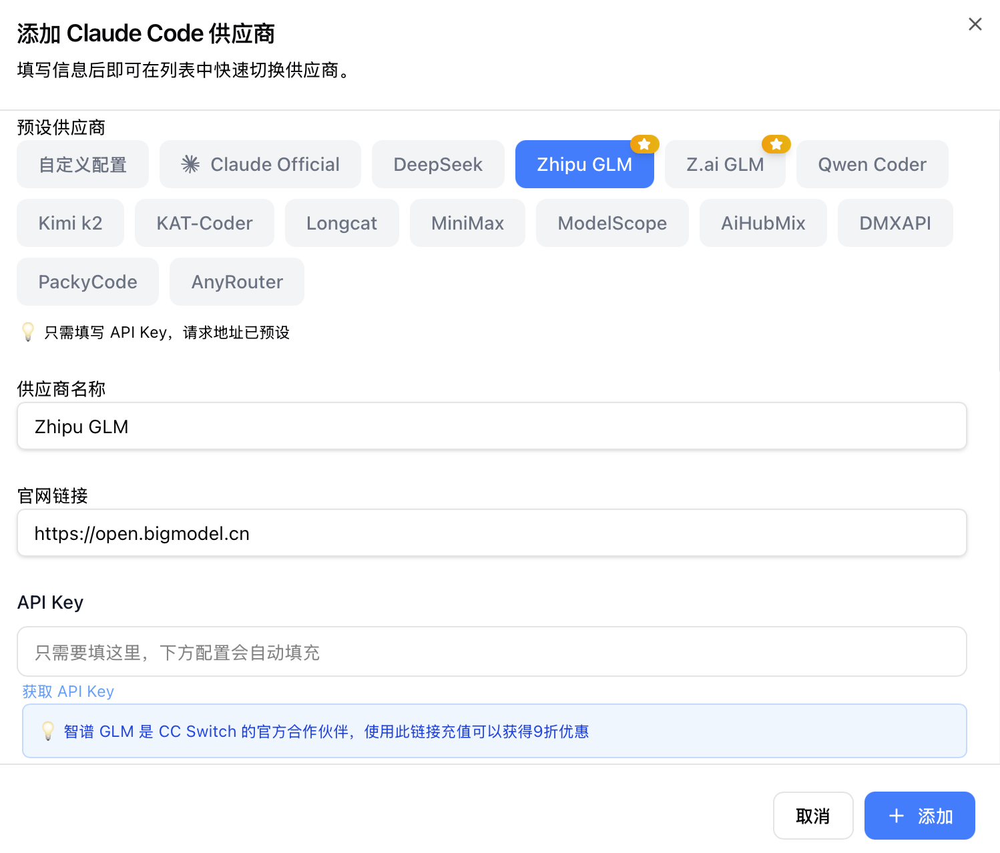

<div align="center">

# CC Doctor

### Claude Code 环境医生 + 多 CLI 一站式管理工具

[](https://github.com/diaojz/cc-doctor/releases)
[](https://github.com/diaojz/cc-doctor/releases)
[](https://tauri.app/)
[](https://github.com/diaojz/cc-doctor/releases/latest)

中文 | [English](README_EN.md) | [日本語](README_JA.md) | [更新日志](CHANGELOG.md)

</div>

## 是什么

**CC Doctor** 是一个跨平台桌面应用，干两件事：

1. **环境医生** — 自动诊断 Claude Code 的安装/配置/环境变量/权限问题，一键修复、一键安装、一键卸载。
2. **多 CLI 管理** — 在一个界面里管理 Claude Code、Codex、Gemini CLI、OpenCode、OpenClaw 五个 CLI 的供应商、MCP、Prompts、Skills 和会话历史。

不用手动改 JSON / TOML / `.env`，不用记每个工具的配置路径在哪。

## 核心功能

### 🩺 环境医生（招牌）

- **一键诊断** — 扫描工具安装状态、Node.js 版本、环境变量冲突、配置文件完整性、目录权限。问题按 Critical / High / Medium / Low 分级展示。
- **一键修复** — 自动修复可自动修复的问题：清理冲突环境变量（自动备份 shell 配置）、重建损坏的配置文件、修复目录权限。
- **一键安装 Claude Code** — 检测系统环境后用官方 install.sh（macOS/Linux）或 npm（Windows）安装；自带实时日志面板，支持取消。
- **检查更新与升级** — 检测当前 Claude Code 版本，需要时一键升级。
- **Homebrew → 官方迁移**（macOS）— 自动识别 `brew install` 安装的 Claude Code，预览迁移步骤并执行迁移，避免后续升级冲突。
- **一键卸载** — 彻底清理 Claude Code 安装目录、配置、PATH、注册表项（Windows）。支持 dry-run 预览，自动备份。

### 🔀 供应商切换

- **五个 CLI、50+ 预设** — Claude Code、Codex、Gemini CLI、OpenCode、OpenClaw 都内置常见官方/中转/自部署预设。
- **通用供应商** — 一份配置同步到 OpenCode、OpenClaw 等多个应用。
- **托盘快切** — 不打开主界面，从系统托盘直接切换供应商。
- **官方登录共存** — 预设里加一个「官方登录」，可在第三方供应商和官方账号之间随意来回。

### 🧩 扩展统一管理

- **MCP** — 一个面板管理 4 个应用的 MCP 服务器，双向同步，支持 Deep Link 一键导入。
- **Prompts** — Markdown 编辑器，跨应用同步 `CLAUDE.md` / `AGENTS.md` / `GEMINI.md`，自带回填保护。
- **Skills** — 从 GitHub 仓库或 ZIP 一键安装，可选软链接或文件复制两种部署方式。

### 🌐 代理与故障转移

- **本地代理热切换** — 内置格式转换、自动故障转移、熔断器、健康监控、整流器。
- **应用级代理接管** — 独立为 Claude / Codex / Gemini 配置代理，粒度细到单个供应商。

### 📊 用量与会话

- **用量仪表盘** — 跨供应商追踪 Token、请求数、花费，含趋势图、详细请求日志和自定义模型定价。
- **会话管理器** — 浏览、搜索、恢复全部 CLI 的对话历史；OpenClaw 还支持工作区编辑器（AGENTS.md / SOUL.md 等）。

### 🔒 数据与同步

- **云同步** — 自定义配置目录到 Dropbox / OneDrive / iCloud / 坚果云 / NAS；也支持 WebDAV 服务器。
- **Deep Link** — `ccdoctor://` 协议，URL 一键导入供应商、MCP、Prompts、Skills。
- **可靠性** — SQLite 单一事实源、原子写入（临时文件 + 重命名）、自动备份轮换（保留 10 份）。

## 界面预览

|                  主界面                   |                  添加供应商                  |
| :---------------------------------------: | :------------------------------------------: |
|  |  |

## 下载安装

### 系统要求

- **Windows** 10 及以上
- **macOS** 12 (Monterey) 及以上
- **Linux** Ubuntu 22.04+ / Debian 11+ / Fedora 34+ 等主流发行版

### macOS

**Homebrew（推荐）**

```bash
brew tap diaojz/cc-doctor
brew install --cask cc-doctor

# 升级
brew upgrade --cask cc-doctor
```

**手动下载**

从 [Releases](../../releases) 下载 `CC-Doctor-v{版本}-macOS.dmg`。已通过 Apple 代码签名和公证，直接打开即可。

### Windows

从 [Releases](../../releases) 下载：

- `CC-Doctor-v{版本}-Windows.msi`（安装版）
- `CC-Doctor-v{版本}-Windows-Portable.zip`（绿色版）

### Linux

**Arch（推荐）**

```bash
paru -S cc-doctor-bin
```

**其他发行版**

从 [Releases](../../releases) 下载对应包：

- `.deb` — Debian / Ubuntu
- `.rpm` — Fedora / RHEL / openSUSE
- `.AppImage` — 通用

> Flatpak 不在官方 Release 中。需要可参考 [`flatpak/README.md`](flatpak/README.md) 从 `.deb` 自行构建。

## 快速上手

1. **首次启动** — 可选择把现有 CLI 配置导入为默认供应商。
2. **加供应商** — 「添加供应商」→ 选预设或填自定义 → 保存。
3. **切供应商** — 主界面点「启用」，或从系统托盘直接点供应商名字（立即生效）。
4. **环境出问题** — 打开设置 → 环境医生面板，按提示「一键修复」或「一键安装」。
5. **管 MCP / Prompts / Skills** — 顶部对应按钮，添加配置后切换各应用同步开关即可。
6. **切回官方登录** — 预设里加「官方登录」，切过去后跑一次 Log out / Log in。

> 切换供应商后大多数 CLI 需要重启终端；**Claude Code 例外，支持热切换**。

## 常见问题

<details>
<summary><strong>CC Doctor 支持哪些 CLI？</strong></summary>

Claude Code、Codex、Gemini CLI、OpenCode、OpenClaw 五个。每个都有专属预设与配置管理。

</details>

<details>
<summary><strong>「一键安装 Claude Code」用的是什么方式？</strong></summary>

- macOS / Linux：官方 `install.sh`
- Windows：通过 npm 安装

安装过程在面板里实时输出日志，过程中可以取消。

</details>

<details>
<summary><strong>已经用 Homebrew 装了 Claude Code，会冲突吗？</strong></summary>

不冲突，但官方推荐用 install.sh 安装。CC Doctor 检测到 brew 安装时会在环境医生面板里显示一条 Low 级别的提醒，点「迁移」会先预览要做的操作再执行 brew 卸载 + 官方安装。整个过程可取消、可 dry-run。

</details>

<details>
<summary><strong>「一键卸载」会动到哪些东西？</strong></summary>

- Claude Code 二进制 / npm 全局包
- `~/.claude/` 配置与会话目录
- shell rc 里的 PATH 片段（自动备份原文件）
- Windows 注册表项（卸载后广播 `WM_SETTINGCHANGE` 通知 Explorer 重读 PATH）

支持 dry-run，所有破坏性操作前都会备份；卸载失败的步骤会单独展示。

</details>

<details>
<summary><strong>切换供应商后需要重启终端吗？</strong></summary>

大多数 CLI 需要重启终端或 CLI 工具才生效。**Claude Code 支持热切换**，不需要重启。

</details>

<details>
<summary><strong>切换供应商后我的插件配置怎么不见了？</strong></summary>

CC Doctor 用「通用配置片段」在不同供应商之间传递 Key 和请求地址之外的通用数据。在「编辑供应商」→「通用配置面板」点「从当前供应商提取」即可把通用数据抽出来；之后新建供应商时勾选「写入通用配置」（默认勾选），插件等数据会自动写入新供应商的配置。

所有配置项都保存在首次导入时的默认供应商里，**不会丢失**。

</details>

<details>
<summary><strong>为什么总有一个激活中的供应商无法删除？</strong></summary>

设计原则是「最小侵入」：即使卸载 CC Doctor，对应 CLI 也能继续用。所以总会保留一个激活配置，避免把所有配置删空导致 CLI 无法启动。不常用的应用可以在设置里关掉显示。

</details>

<details>
<summary><strong>如何切换回官方登录？</strong></summary>

在预设里加一个「官方登录」供应商，切过去后执行一遍 Log out / Log in，之后就能在官方和第三方供应商之间自由切换。Codex 还支持在多个官方账号（Plus / Team）之间切换。

</details>

<details>
<summary><strong>数据存在哪里？</strong></summary>

| 位置 | 内容 |
| ---- | ---- |
| `~/.cc-doctor/cc-doctor.db` | SQLite — 供应商 / MCP / Prompts / Skills |
| `~/.cc-doctor/settings.json` | 设备级 UI 偏好 |
| `~/.cc-doctor/backups/` | 自动备份，保留最近 10 份 |
| `~/.cc-doctor/skills/` | Skills 仓库（默认软链接到对应应用） |
| `~/.cc-doctor/skill-backups/` | Skills 卸载前自动备份，保留最近 20 份 |

</details>

## 文档

各项功能的详细用法见 **[用户手册](docs/user-manual/zh/README.md)** — 涵盖供应商管理、MCP / Prompts / Skills、代理与故障转移、环境医生等全部能力。

最新版本说明：[v3.14.1](docs/release-notes/v3.14.1-zh.md)。

## 开发

<details>
<summary><strong>环境与命令</strong></summary>

### 环境要求

- Node.js 18+
- pnpm 8+
- Rust 1.85+
- Tauri CLI 2.8+

### 前端

```bash
pnpm install              # 安装依赖
pnpm dev                  # 开发模式（热重载）
pnpm typecheck            # 类型检查
pnpm format               # 代码格式化
pnpm format:check         # 检查格式
pnpm test:unit            # 单元测试
pnpm test:unit:watch      # 监听模式
pnpm build                # 构建
pnpm tauri build --debug  # 调试版本
```

### 后端

```bash
cd src-tauri
cargo fmt                         # 格式化
cargo clippy                      # 静态检查
cargo test                        # 测试
cargo test --features test-hooks  # 带测试 hooks
```

### 技术栈

- **前端**：React 18 · TypeScript · Vite · TailwindCSS · TanStack Query · react-i18next · react-hook-form · zod · shadcn/ui · @dnd-kit
- **后端**：Tauri 2.8 · Rust · serde · tokio · thiserror · tauri-plugin-{updater,process,dialog,store,log}
- **测试**：vitest · MSW · @testing-library/react

</details>

<details>
<summary><strong>架构总览</strong></summary>

```
┌─────────────────────────────────────────────────────────────┐
│                    前端 (React + TS)                         │
│  ┌─────────────┐  ┌──────────────┐  ┌──────────────────┐    │
│  │ Components  │  │    Hooks     │  │  TanStack Query  │    │
│  │   （UI）     │──│ （业务逻辑）   │──│   （缓存/同步）    │    │
│  └─────────────┘  └──────────────┘  └──────────────────┘    │
└────────────────────────┬────────────────────────────────────┘
                         │ Tauri IPC
┌────────────────────────▼────────────────────────────────────┐
│                  后端 (Tauri + Rust)                         │
│  ┌─────────────┐  ┌──────────────┐  ┌──────────────────┐    │
│  │  Commands   │  │   Services   │  │  Models/Config   │    │
│  │ （API 层）   │──│  （业务层）    │──│    （数据）       │    │
│  └─────────────┘  └──────────────┘  └──────────────────┘    │
└─────────────────────────────────────────────────────────────┘
```

**核心设计模式**

- **SSOT** — 所有数据存 `~/.cc-doctor/cc-doctor.db`（SQLite）
- **双层存储** — SQLite 存可同步数据，JSON 存设备级设置
- **双向同步** — 切换时写入 live 文件，编辑当前供应商时从 live 回填
- **原子写入** — 临时文件 + 重命名，防止配置损坏
- **并发安全** — Mutex 保护的数据库连接避免竞态
- **分层架构** — Commands → Services → DAO → Database

**核心模块**

- `EnvDoctor` — 环境诊断 / 修复
- `ClaudeInstaller` — install.sh / npm 双渠道安装、检查更新
- `BrewMigration` — Homebrew → 官方安装迁移（macOS）
- `Uninstall` — 一键卸载，含 dry-run 与备份
- `ProviderService` — 供应商增删改查、切换、回填、排序
- `McpService` — MCP 服务器管理、导入导出、live 文件同步
- `ProxyService` — 本地 Proxy 模式，支持热切换和格式转换
- `SessionManager` — 全应用会话历史
- `ConfigService` — 配置导入导出、备份轮换
- `SpeedtestService` — API 端点延迟测量

</details>

<details>
<summary><strong>项目结构</strong></summary>

```
├── src/                        # 前端 (React + TypeScript)
│   ├── components/
│   │   ├── providers/          # 供应商管理
│   │   ├── mcp/                # MCP 面板
│   │   ├── prompts/            # Prompts 管理
│   │   ├── skills/             # Skills 管理
│   │   ├── sessions/           # 会话管理器
│   │   ├── proxy/              # Proxy 模式面板
│   │   ├── openclaw/           # OpenClaw 配置面板
│   │   ├── env/                # 环境医生横幅
│   │   ├── settings/           # 设置 + 环境医生面板
│   │   ├── deeplink/           # Deep Link 导入
│   │   ├── universal/          # 跨应用配置
│   │   ├── usage/              # 用量统计
│   │   └── ui/                 # shadcn/ui 组件
│   ├── hooks/                  # 自定义 hooks
│   ├── lib/api/                # Tauri API 封装
│   ├── i18n/locales/           # 翻译 (zh/en/ja)
│   ├── config/                 # 预设 (providers/mcp)
│   └── types/                  # TypeScript 类型
├── src-tauri/                  # 后端 (Rust)
│   └── src/
│       ├── commands/           # Tauri 命令层
│       │   ├── doctor.rs       # 诊断 / 修复 / 安装 / 更新 / 迁移
│       │   ├── uninstall.rs    # 一键卸载
│       │   ├── env.rs          # PATH / 环境变量
│       │   └── ...
│       ├── services/           # 业务逻辑
│       │   ├── env_doctor.rs   # 环境诊断核心
│       │   ├── claude_installer.rs
│       │   ├── brew_migration.rs
│       │   ├── uninstall.rs
│       │   └── ...
│       ├── database/           # SQLite DAO
│       ├── proxy/              # Proxy 模块
│       └── session_manager/    # 会话管理
├── tests/                      # 前端测试
└── assets/                     # 截图
```

</details>

## 贡献

欢迎提 Issue 反馈问题或建议。

提交 PR 前请确保：

- `pnpm typecheck` 通过
- `pnpm format:check` 通过
- `pnpm test:unit` 通过

新功能建议先开 Issue 讨论方案，不符合项目方向的功能性 PR 可能会被关闭。

## Star History

[](https://www.star-history.com/#diaojz/cc-doctor&Date)

## License

MIT © Jason Young
