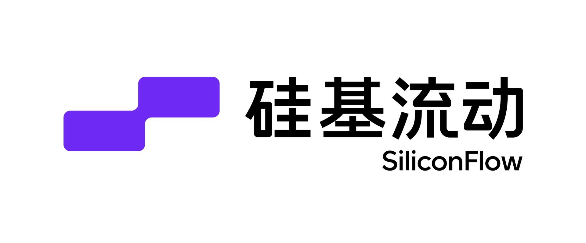
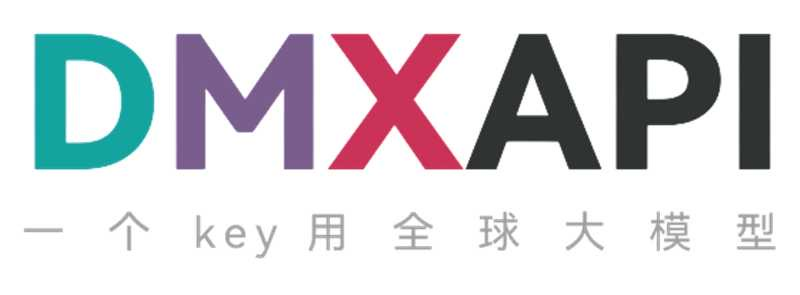

<div align="center">

# CC Switch Legacy

### 一个为 macOS 10.15 Catalina 提供兼容支持的 CC Switch 分支

[](#兼容性)
[](#兼容性)
[](https://tauri.app/)

[English](README.md) | 中文 | [兼容性适配说明](docs/macos-10.15-compat.md) | [上游项目](https://github.com/farion1231/cc-switch) | [更新日志](CHANGELOG.md)

</div>

> [!NOTE]
> **这是 CC Switch 的 Legacy 版本，专为兼容 macOS 10.15 (Catalina) 而维护。**
>
> 主仓库的 CC Switch 依赖 Tauri 2 所使用的较新系统 API，因此要求 macOS 12 (Monterey) 及以上。然而仍有大量用户在使用 macOS 10.15，本仓库以牺牲部分新特性为代价，为他们提供一个可运行的 Legacy 构建版本。
>
> 如果你的系统是 macOS 12 或更新版本，请使用[主仓库版本](https://github.com/farion1231/cc-switch)以获取最新功能和更新。

## ❤️赞助商

> [想出现在这里？](mailto:farion1231@gmail.com)

<details open>
<summary>点击折叠</summary>

[](https://platform.minimaxi.com/subscribe/coding-plan?code=7kYF2VoaCn&source=link)

MiniMax M2.7 是 MiniMax 首个深度参与自我迭代的模型，可自主构建复杂 Agent Harness，并基于 Agent Teams、复杂 Skills、Tool Search Tool 等能力完成高复杂度生产力任务；其在软件工程、端到端项目交付及办公场景中表现优异，多项评测接近行业领先水平，同时具备稳定的复杂任务执行、环境交互能力以及良好的情商与身份保持能力。

[点击此处](https://platform.minimaxi.com/subscribe/coding-plan?code=7kYF2VoaCn&source=link)享 MiniMax Token Plan 专属 88 折优惠！

---

<table>
<tr>
<td width="180"><a href="https://www.packyapi.com/register?aff=cc-switch"></a></td>
<td>感谢 PackyCode 赞助了本项目！PackyCode 是一家稳定、高效的API中转服务商，提供 Claude Code、Codex、Gemini 等多种中转服务。PackyCode 为本软件的用户提供了特别优惠，使用<a href="https://www.packyapi.com/register?aff=cc-switch">此链接</a>注册并在充值时填写"cc-switch"优惠码，首次充值可以享受9折优惠！</td>
</tr>

<tr>
<td width="180"><a href="https://cloud.siliconflow.cn/i/drGuwc9k"></a></td>
<td>感谢硅基流动赞助了本项目！硅基流动是一个高性能 AI 基础设施与模型 API 平台，一站式提供语言、语音、图像、视频等多模态模型的快速、可靠访问。平台支持按量计费、丰富的多模态模型选择、高速推理和企业级稳定性，帮助开发者和团队更高效地构建和扩展 AI 应用。通过<a href="https://cloud.siliconflow.cn/i/drGuwc9k">此链接</a>注册并完成实名认证，即可获得 ¥20 奖励金，可在平台内跨模型使用。硅基流动现已兼容 OpenClaw，用户可接入硅基流动 API Key 免费调用主流 AI 模型。</td>
</tr>

<tr>
<td width="180"><a href="https://aigocode.com/invite/CC-SWITCH"></a></td>
<td>感谢 AIGoCode 赞助了本项目！AIGoCode 是一个集成了 Claude Code、Codex 以及 Gemini 最新模型的一站式平台，为你提供稳定、高效且高性价比的AI编程服务。本站提供灵活的订阅计划，零封号风险，国内直连，无需魔法，极速响应。AIGoCode 为 CC Switch 的用户提供了特别福利，通过<a href="https://aigocode.com/invite/CC-SWITCH">此链接</a>注册的用户首次充值可以获得额外10%奖励额度！</td>
</tr>

<tr>
<td width="180"><a href="https://www.aicodemirror.com/register?invitecode=9915W3"></a></td>
<td>感谢 AICodeMirror 赞助了本项目！AICodeMirror 提供 Claude Code / Codex / Gemini CLI 官方高稳定中转服务，支持企业级高并发、极速开票、7×24 专属技术支持。
Claude Code / Codex / Gemini 官方渠道低至 3.8 / 0.2 / 0.9 折，充值更有折上折！AICodeMirror 为 CCSwitch 的用户提供了特别福利，通过<a href="https://www.aicodemirror.com/register?invitecode=9915W3">此链接</a>注册的用户，可享受首充8折，企业客户最高可享 7.5 折！</td>
</tr>

<tr>
<td width="180"><a href="https://cubence.com/signup?code=CCSWITCH&source=ccs"></a></td>
<td>感谢 Cubence 赞助本项目！Cubence 是一家可靠高效的 API 中继服务提供商，提供对 Claude Code、Codex、Gemini 等模型的中继服务，并提供按量、包月等灵活的计费方式。Cubence 为 CC Switch 的用户提供了特别优惠：使用 <a href="https://cubence.com/signup?code=CCSWITCH&source=ccs">此链接</a> 注册，并在充值时输入 "CCSWITCH" 优惠码，每次充值均可享受九折优惠！</td>
</tr>

<tr>
<td width="180"><a href="https://www.dmxapi.cn/register?aff=bUHu"></a></td>
<td>感谢 DMXAPI（大模型API）赞助了本项目！ DMXAPI，一个Key用全球大模型。
为200多家企业用户提供全球大模型API服务。· 充值即开票 ·当天开票 ·并发不限制  ·1元起充 ·  7x24 在线技术辅导，GPT/Claude/Gemini全部6.8折，国内模型5~8折，Claude Code 专属模型3.4折进行中！<a href="https://www.dmxapi.cn/register?aff=bUHu">点击这里注册</a></td>
</tr>

<tr>
<td width="180"><a href="https://www.compshare.cn/coding-plan?ytag=GPU_YY_YX_git_cc-switch"></a></td>
<td>感谢优云智算赞助了本项目！优云智算是UCloud旗下AI云平台，提供稳定、全面的国内外模型API，仅一个key即可调用。主打包月、按量的高性价比 Coding Plan 套餐，基于官方2~5折优惠。支持接入 Claude Code、Codex 及 API 调用。支持企业高并发、7*24技术支持、自助开票。通过<a href="https://www.compshare.cn/coding-plan?ytag=GPU_YY_YX_git_cc-switch">此链接</a>注册的用户，可得免费5元平台体验金！</td>
</tr>

<tr>
<td width="180"><a href="https://www.right.codes/register?aff=CCSWITCH"></a></td>
<td>感谢 Right Code 赞助了本项目！Right Code 稳定提供 Claude Code、Codex、Gemini 等模型的中转服务。主打<strong>极高性价比</strong>的Codex包月套餐，<strong>提供额度转结，套餐当天用不完的额度，第二天还能接着用！</strong>充值即可开票，企业、团队用户一对一对接。同时为 CC Switch 的用户提供了特别优惠：通过<a href="https://www.right.codes/register?aff=CCSWITCH">此链接</a>注册，每次充值均可获得实付金额25%的按量额度！</td>
</tr>

这个仓库是基于 [CC Switch](https://github.com/farion1231/cc-switch) 的兼容性分支。

这个分支的目标很明确：尽量保持原版 CC Switch 的使用体验，同时让桌面应用可以在 **macOS 10.15 Catalina** 上构建和运行。上游项目当前已经不再以 10.15 为兼容目标，所以这里单独维护一个 legacy 分支。

如果你使用的是 macOS 12 及以上，而且并不需要 Catalina 兼容性，那么优先使用上游项目会更合适。

## 这个分支改了什么

相对于上游 CC Switch，这个分支主要针对老版本 macOS 做了以下兼容处理：

- 将 macOS 部署目标从 `12.0` 下调到 `10.15`
- 调整 Tauri 打包配置，使应用允许在 `macOS 10.15+` 安装运行
- 为旧版 WebKit 缺失的协议方法加入 `objc2` 开发模式兼容处理
- 将 `esbuild` 固定到 `0.21.5`，避免依赖更高版本 macOS 才有的系统符号
- 下调前端构建目标，兼容旧版 Safari / WKWebView
- 将 `smol-toml` 替换为 `@iarna/toml`，规避 Safari 13 对 `BigInt` 语法的不兼容
- 为主题监听增加 `MediaQueryList.addListener` 回退逻辑

详细适配过程见 [docs/macos-10.15-compat.md](docs/macos-10.15-compat.md)。

## 功能概览

这个分支保留了 CC Switch 的主要功能：

- 在一个桌面应用里统一管理 **Claude Code**、**Codex**、**Gemini CLI**、**OpenCode**、**OpenClaw**
- 无需手改 JSON、TOML、`.env` 文件即可导入和切换 provider
- 统一管理 **MCP**、**Prompts**、**Skills**
- 支持系统托盘快速切换 provider
- 提供使用量和费用统计视图
- 支持通过自定义配置目录或 WebDAV 做数据同步
- 支持浏览和恢复多种 CLI 工具的会话记录

## 界面预览

| 主界面 | 添加 Provider |
| :---: | :---: |
|  |  |

## 兼容性

### 主要目标平台

- macOS 10.15 Catalina

### 理论上也应继续可用

- macOS 11 及以上
- Windows
- Linux

这个仓库存在的主要原因就是维护 Catalina 兼容性，其他平台原则上尽量保持与上游一致。

## 快速开始

### 基本使用

1. 在主界面中添加一个 provider
2. 启用你想使用的 provider
3. 按对应 CLI 的要求重启终端或工具进程
4. 需要快速切换时可直接使用托盘菜单

### 文档入口

- [macOS 10.15 兼容适配说明](docs/macos-10.15-compat.md)
- [用户手册 English](docs/user-manual/en/README.md)
- [用户手册 中文](docs/user-manual/zh/README.md)
- [ユーザーマニュアル 日本語](docs/user-manual/ja/README.md)

### 系统要求

- **Windows**：Windows 10 及以上
- **macOS**：macOS 10.15 (Catalina) 及以上
- **Linux**：Ubuntu 22.04+ / Debian 11+ / Fedora 34+ 等主流发行版

### Windows 用户

从 [Releases](../../releases) 页面下载最新版本的 `CC-Switch-v{版本号}-Windows.msi` 安装包或 `CC-Switch-v{版本号}-Windows-Portable.zip` 绿色版。

### macOS 用户

**方式一：通过 Homebrew 安装（推荐）**

```bash
brew tap farion1231/ccswitch
brew install --cask cc-switch
```

更新：

```bash
brew upgrade --cask cc-switch
```

**方式二：手动下载**

从 [Releases](../../releases) 页面下载 `CC-Switch-v{版本号}-macOS.dmg`（推荐）或 `.zip`。

> **注意**：CC Switch macOS 版本已通过 Apple 代码签名和公证，可直接安装打开。

### Arch Linux 用户

**通过 paru 安装（推荐）**

```bash
paru -S cc-switch-bin
```

### Linux 用户

从 [Releases](../../releases) 页面下载最新版本的 Linux 安装包：

- `CC-Switch-v{版本号}-Linux.deb`（Debian/Ubuntu）
- `CC-Switch-v{版本号}-Linux.rpm`（Fedora/RHEL/openSUSE）
- `CC-Switch-v{版本号}-Linux.AppImage`（通用）

> **Flatpak**：官方 Release 不包含 Flatpak 包。如需使用，可从 `.deb` 自行构建 — 参见 [`flatpak/README.md`](flatpak/README.md)。

<details>
<summary><strong>架构总览</strong></summary>

### 设计原则

```
┌─────────────────────────────────────────────────────────────┐
│                    前端 (React + TS)                         │
│  ┌─────────────┐  ┌──────────────┐  ┌──────────────────┐    │
│  │ Components  │  │    Hooks     │  │  TanStack Query  │    │
│  │   （UI）     │──│ （业务逻辑）   │──│   （缓存/同步）    │    │
│  └─────────────┘  └──────────────┘  └──────────────────┘    │
└────────────────────────┬────────────────────────────────────┘
                         │ Tauri IPC
┌────────────────────────▼────────────────────────────────────┐
│                  后端 (Tauri + Rust)                         │
│  ┌─────────────┐  ┌──────────────┐  ┌──────────────────┐    │
│  │  Commands   │  │   Services   │  │  Models/Config   │    │
│  │ （API 层）   │──│  （业务层）    │──│    （数据）       │    │
│  └─────────────┘  └──────────────┘  └──────────────────┘    │
└─────────────────────────────────────────────────────────────┘
```

**核心设计模式**

- **SSOT**（单一事实源）：所有数据存储在 `~/.cc-switch/cc-switch.db`（SQLite）
- **双层存储**：SQLite 存储可同步数据，JSON 存储设备级设置
- **双向同步**：切换时写入 live 文件，编辑当前供应商时从 live 回填
- **原子写入**：临时文件 + 重命名模式防止配置损坏
- **并发安全**：Mutex 保护的数据库连接避免竞态条件
- **分层架构**：清晰分离（Commands → Services → DAO → Database）

**核心组件**

- **ProviderService**：供应商增删改查、切换、回填、排序
- **McpService**：MCP 服务器管理、导入导出、live 文件同步
- **ProxyService**：本地 Proxy 模式，支持热切换和格式转换
- **SessionManager**：全应用会话历史浏览
- **ConfigService**：配置导入导出、备份轮换
- **SpeedtestService**：API 端点延迟测量

</details>

<details>
<summary><strong>开发指南</strong></summary>

### 环境要求

- Node.js 18+
- pnpm 8+
- Rust 1.85+
- Tauri CLI 2.8+

### 常用命令

```bash
pnpm install
pnpm dev
pnpm typecheck
pnpm test:unit
pnpm build
```

### Rust 后端

```bash
cd src-tauri
cargo fmt
cargo clippy
cargo test
```

## macOS 10.15 相关说明

这个分支已经内置了几项关键的 Catalina 兼容配置：

- `.cargo/config.toml` 中设置了 `MACOSX_DEPLOYMENT_TARGET=10.15`
- `src-tauri/tauri.conf.json` 中将 `minimumSystemVersion` 设置为 `10.15`
- `vite.config.ts` 里下调了 Safari 相关构建目标
- `package.json` 中将 `esbuild` 固定到 Catalina 可用的版本

如果你遇到 Catalina 专属问题，建议先看 [docs/macos-10.15-compat.md](docs/macos-10.15-compat.md)。

## 项目结构

```text
src/              前端（React + TypeScript）
src-tauri/        后端（Tauri + Rust）
assets/           截图与静态资源
docs/             兼容性说明、用户手册、发布说明
tests/            前端测试
```

## 致谢

- 原始项目：[farion1231/cc-switch](https://github.com/farion1231/cc-switch)
- 本仓库是兼容性分支，不是上游官方发布渠道

## 许可证

本项目继续使用 [MIT License](LICENSE)。
