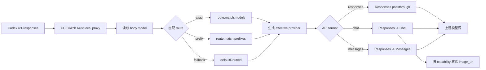

# Codex Model Router Workspace Prototype v3

## 背景

第一版把 Local model routing 放进 `CodexFormFields`，更像高级 JSON 表单的可视化版本。用户真正需要的是先维护多个模型源，再把这些源组合成一个 Codex 可选择的 router provider。v2 把主入口改为独立工作区，v3 进一步按真实 CCSwitch 桌面比例和暗色风格重做：页面不再是白底竖向长页，而是 16:10 宽屏窗口里的多页横向工作流。

静态原型：

- `docs/prototypes/codex-router-workspace-prototype.html`

## 本轮修正覆盖的问题

1. **贴合 CCSwitch UI 风格**：使用暗色 `background/card/border` 色系、顶部 64px 工具栏、`AppSwitcher` 分段按钮、长条 Provider 卡片、橙色圆形新增按钮、蓝色 active 边框、绿色/琥珀/蓝色状态 badge，而不是泛 SaaS 白底 dashboard。
2. **补齐入口和出口**：入口来自 Codex Provider 列表、Codex 表单的 Local model routing 区、Universal Provider；出口是发布后回到 Codex Provider 列表，并高亮生成的 router provider。
3. **补齐模型源创建指导**：模型源库支持导入现有 Provider、创建新 Provider、测试连接、拉取模型、查询能力、手动修正能力、保存为 source。
4. **补齐模型列表和可见性控制**：每个 source 可拉取模型列表，用户只勾选要暴露给 Codex 的模型，未勾选模型仍保留在 source 库，不进入 Codex catalog。
5. **补齐 route 成功测试**：发布前必须通过 route test，验证 local proxy、resolver、protocol transform、上游请求、text-only 防 `image_url` 等关键链路。
6. **修正页面比例和信息架构**：v3 拆成 Overview / Sources / Models / Routes / Test & Publish 五个页面，用左侧步骤导航切换；每页在单个宽屏视口内横向排布，避免原型变成正方形或竖向长卷。

## 五点验收矩阵

| 问题 | 原型里的直接体现 | 真实 UI 实现点 | 发布前验证 |
| --- | --- | --- | --- |
| UI 风格不搭 | 暗色窗口、顶部工具条、Codex `AppSwitcher`、长条 Provider 风格 source card、橙色圆形新增按钮、状态 badge | 复用现有 `Button`、`ProviderIcon`、`AppSwitcher`、card/badge/tabs 样式，不新增独立设计系统 | 打开工作区后与 Provider 列表/Universal Provider 在间距、按钮、卡片、状态色、横向比例上连续 |
| 缺入口出口 | 左侧步骤导航底部固定展示入口/出口；Overview 展示 router provider 摘要；Test & Publish 展示“写入 Router Provider → 返回 Codex Provider 列表 → 高亮 Router” | `App.tsx` 新增 `modelRouter` view；`ProviderList`、`CodexFormFields`、`UniversalProviderPanel` 进入；发布后 `setCurrentView("providers")` | 从三个入口进入都能带入上下文，发布/取消都能回到 Codex provider 列表 |
| 模型源缺配置引导和能力操作 | 左侧模型源库提供导入、新建、测试连接、拉取模型、查询能力、手动校正、实测能力 | `RouterSourceEditorDialog` 管 base URL/auth/API format；`RouterModelCatalogPanel` 管能力查询、手动编辑、实测结果 | 未连接、未拉取、能力未知、能力冲突都能在 UI 中显示并阻止或警告发布 |
| 汇总配置缺模型可见性选择 | 模型可见性表有可见勾选列、source 筛选、已选 7/26 计数、未选模型保留在备用 source | draft 中 `RouterModelDraft.visible` 决定 Codex catalog；`upstreamModel/displayName` 支持每个模型改名和映射 | 只有 visible=true 的模型进入 `codexRouting` 和 Codex catalog，未勾选模型不会污染可切换列表 |
| 缺 route 成功测试 | 发布前路由测试面板展示 local proxy、resolver、protocol transform、上游 route 结果 | 新增 `codex_router_test_route(routerDraft, modelId, testInput)`，通过 Rust local proxy 模拟 Codex `/responses` 请求 | route test 失败禁用发布；text-only route 必须证明不会向上游发送 `image_url` |

## 推荐页面结构

页面名：**Model Router**

位置：和 Providers / Universal Provider 平级，但当前设计仍放在 Codex 上下文内打开。这样用户知道它最终生成的是 Codex Router Provider，同时又不会误以为必须先切 GUI 当前 provider 才能使用 DeepSeek/Qwen 等模型。

页面区域：

- 外层：模拟真实 CCSwitch Tauri 窗口比例，默认暗色，宽屏横向布局。
- Header：返回按钮、CC Switch 标题、代理/故障转移 toggle、Codex app switcher、工具按钮、橙色圆形新增按钮。
- 左侧：Model Router 步骤导航，固定展示 Overview / Sources / Models / Routes / Test & Publish。
- 主区域：一次只显示一个页面，每个页面在可视区内横向排布。
- Overview：入口/出口和 router provider 摘要。
- Sources：模型源库和新 Provider 引导。
- Models：模型拉取、可见性勾选、能力操作。
- Routes：route 汇总、default route、model mapping。
- Test & Publish：发布前链路测试和发布预览。

## 新逻辑如何在真实 UI 里实现

### 1. App 入口

在 `src/App.tsx` 的 `View` union 中新增 `modelRouter`。渲染逻辑与 `UniversalProviderPanel` 类似：

- 当 `currentView === "modelRouter"` 时渲染 `ModelRouterWorkspace`。
- 顶部 header 仍使用现有 `AppSwitcher`，`activeApp` 固定保持用户当前 app。若从 Codex 进入，`activeApp` 为 `codex`。
- 返回按钮调用 `setCurrentView("providers")`，并保留 `activeApp = "codex"`。

入口建议：

- `ProviderList`：当 `appId === "codex"` 时，在搜索/新增 Provider 附近加一个 `Model Router` 按钮。
- `CodexFormFields`：Local model routing 区不再作为主编辑器，而是显示“由 Model Router 管理”的摘要和 `打开 Model Router` 按钮。
- `UniversalProviderPanel`：给 provider card 增加 `Use as model source` 动作，进入工作区后预选该 provider。

### 2. 页面组件拆分

建议新增目录：

```text
src/components/codex-router/
  ModelRouterWorkspace.tsx
  RouterSourceLibrary.tsx
  RouterSourceEditorDialog.tsx
  RouterModelCatalogPanel.tsx
  RouterSummaryPanel.tsx
  RouteTestPanel.tsx
  codexRouterDraft.ts
```

组件职责：

- `ModelRouterWorkspace`：持有 draft 状态、入口上下文、当前页面、保存/发布流程。
- `RouterSourceLibrary`：展示模型源卡片，处理导入、创建、加入/移出 router。
- `RouterSourceEditorDialog`：编辑 base URL、API format、auth source、API key、能力。
- `RouterModelCatalogPanel`：拉取模型、勾选可见模型、编辑显示名、编辑模型映射、能力检测。
- `RouterSummaryPanel`：根据可见模型生成 route，处理 exact/prefix/default/modelMap。
- `RouteTestPanel`：按模型运行测试，展示 resolver 和 protocol transform 结果。

页面导航建议：

- `OverviewPage`：router provider 摘要、入口出口、关键指标。
- `SourcesPage`：source library、新 provider wizard。
- `ModelsPage`：fetched model table、visible checkbox、capability state。
- `RoutesPage`：route rows、default route、conflict validation。
- `TestPublishPage`：route test pipeline、publish preview。

这些页面可以先作为 `ModelRouterWorkspace` 内部的子组件实现，不需要立即接入 React Router。

### 3. 数据流

UI 内部不要直接让用户写 `settings_config.codexRouting`。页面维护一个 router draft：

```ts
type RouterSourceDraft = {
  id: string;
  displayName: string;
  sourceKind: "existing_provider" | "new_provider" | "managed_account";
  providerRef?: string;
  baseUrl: string;
  apiFormat: "openai_responses" | "openai_chat" | "openai_messages";
  auth: { source: "provider_config" | "managed_codex_oauth" | "managed_account"; apiKey?: string };
  capabilities: { textOnly?: boolean; inputModalities?: string[]; supportsReasoning?: boolean };
  models: RouterModelDraft[];
};

type RouterModelDraft = {
  id: string;
  visible: boolean;
  displayName?: string;
  upstreamModel?: string;
  capabilityState: "unknown" | "queried" | "manual" | "tested";
  capabilities: RouterSourceDraft["capabilities"];
};
```

发布时再把 draft 转换成 `settings_config.codexRouting`：

- 选中的 visible models 进入 model catalog。
- 每个 source 生成一组 routes。
- exact model 优先，prefix 其次，最后走 `defaultRouteId`。
- 如果后端暂不支持 `sourceId` 引用，则发布时把 source 的 base URL/auth/api format 展开进每条 route 的 `upstream`。
- 如果后端支持 `sources[] + routes[].sourceId`，UI 可以直接写引用式配置。

### 4. 模型拉取和能力检测

需要新增或复用 Tauri command：

- `codex_router_fetch_models(sourceDraft)`：按 base URL/auth/API format 调用上游 `/models` 或兼容接口，返回模型列表。
- `codex_router_probe_capabilities(sourceDraft, modelId)`：做轻量能力检测，至少区分 text-only、image、reasoning。
- `codex_router_test_route(routerDraft, modelId, testInput)`：通过 CC Switch Rust local proxy 模拟 Codex `/responses` 请求，验证 route resolver 和上游转发。
- `codex_router_publish(routerDraft)`：写入 provider 的 `settings_config.codexRouting`，并刷新 Codex live config。

能力来源优先级：

1. route test 的真实结果。
2. capability probe 查询结果。
3. 用户手动编辑结果。
4. 已知旧规则兜底，例如 DeepSeek/Spark text-only fallback。

### 5. Codex 表单里的 Local model routing

真实 UI 里不建议把所有 route 编辑塞回 `CodexFormFields`。Codex 表单保留三件事：

- 显示当前 provider 是否由 Model Router 管理。
- 显示 route 数、可见模型数、默认 route、未通过测试项。
- 提供 `打开 Model Router` 和 `查看生成配置`。

高级用户仍可在 Codex 表单里打开生成的 `codexRouting` 摘要，但默认路径应该是工作区向导，减少手写 route 造成的错误。

## 用户操作流程

1. 用户在 Codex Provider 列表点击 `Model Router`。
2. 进入 Model Router 工作区，导入现有 Provider 或创建新的模型源。
3. 对每个 source 填 base URL、auth、API format，并测试连接。
4. 拉取 source 的模型列表。
5. 勾选要暴露给 Codex 的模型，未勾选模型不进入 catalog。
6. 对模型能力进行查询、实测或手动修正。
7. 自动生成 route，用户可调整 exact/prefix、model mapping、default route。
8. 运行 route test，至少验证每个可见 source 的一条代表模型。
9. 发布生成 Codex Router Provider。
10. 返回 Codex Provider 列表，高亮 `Codex Local Model Router`，提示用户在 Codex 聊天窗口直接切换模型。

## 路由行为

Codex 仍只连接 CC Switch Rust local proxy。用户在 Codex 聊天窗口切换模型后，请求体里的 `body.model` 会进入 resolver：



## 状态和校验

必须在 UI 中直接暴露这些状态：

- source 未测试连接。
- source 模型列表未拉取。
- 模型能力未知。
- text-only route 仍暴露 image capability。
- route exact/prefix 冲突。
- default route 不存在或 source 被禁用。
- managed auth 残留 API key。
- route test 失败或只做了静态校验。

发布按钮规则：

- 存在 route test 失败时禁用发布。
- 存在能力未知时允许保存草稿，但发布前弹出确认。
- text-only/image 冲突必须修正后才能发布。

## 与现有后端实现的关系

当前分支已有 `settings_config.codexRouting`、route resolver、effective provider、Responses/Chat/Messages 转换和 text-only 防 `image_url` 逻辑。v3 UI 不改变这个后端方向，只是把用户可见的编辑方式从“单个 Codex 表单里的 route 列表”改成“暗色宽屏、多页切换的模型源 + 模型可见性 + route 汇总 + route test 工作区”。

第一版发布仍可写成当前 schema：

```json
{
  "codexRouting": {
    "enabled": true,
    "defaultRouteId": "openai-official",
    "routes": [
      {
        "id": "deepseek",
        "match": { "prefixes": ["deepseek-"] },
        "upstream": {
          "baseUrl": "https://api.deepseek.com/v1",
          "apiFormat": "openai_chat",
          "auth": { "source": "provider_config" },
          "modelMap": { "deepseek-v4-flash": "deepseek-chat" }
        },
        "capabilities": {
          "textOnly": true,
          "inputModalities": ["text"],
          "supportsReasoning": true
        }
      }
    ]
  }
}
```

后续如果增加 `sources[]`，UI 只需要调整 publish adapter，不需要改变页面交互。

## 原型不包含的内容

- 没有连接真实 API。
- 没有改动真实 React UI。
- 没有新增 Tauri command。
- 没有改变当前后端 schema。

这个版本用于产品流和 UI 实现方案评审，评审通过后再进入真实组件实现。
