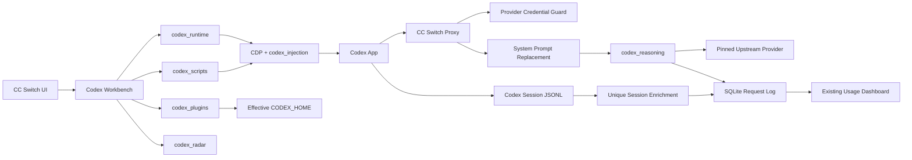

# Codex 专属工作台整合设计

状态：已确认，待实施

日期：2026-07-15

目标基线：CC Switch `f6e37ed`，CodexElves `bf1224e`

## 1. 目标

将 CodexElves 中与 Codex App 配套的实用能力选择性移植到 CC Switch，同时保留 CC Switch 作为供应商、代理、用量统计和故障转移的唯一管理端。整合仅供本机自用，未来获得实施授权后按三个阶段连续完成，不在阶段之间重新进行产品决策。

最终形成四条互相配合但边界清晰的能力链：

1. CC Switch 管理第三方供应商、代理、故障转移与凭据安全。
2. Codex 专属工作台负责增强版 Codex 启动、页面增强、用户脚本、插件和降智雷达。
3. CC Switch 代理负责系统提示词替换、GPT 推理续接和权威 Token 采集。
4. 现有使用统计继续作为请求日志唯一入口，补充推理 Token 与续接标识。

## 2. 方案选择

采用方案 B：提取 CodexElves 的能力并按 CC Switch 架构重组，不并排运行两个管理器，也不保留第二套供应商、代理、日志或设置系统。

整合原则：

- CC Switch SQLite、`AppSettings`、`ProviderMeta` 和现有代理是唯一状态来源。
- 不修改 Codex 官方安装文件、官方快捷方式或官方资源。
- 不强杀已经普通启动的 Codex；需要增强功能时提示用户关闭后以增强模式重启。
- 页面增强失败不得影响 CC Switch 代理和供应商管理。
- 推理续接只扩展一次客户端请求，日志仍只记录一行。
- 移植源码保留 MIT 来源说明和关键算法出处，不整体复制 CodexElves 的应用壳。

## 3. 范围

### 3.1 纳入

- Codex 专属工作台：概览/运行、页面增强、用户脚本、Codex 插件、降智雷达。
- 受控启动增强版 Codex，使用 Chromium DevTools Protocol（CDP）注入。
- 页面增强：插件入口/市场解锁、自动展开、会话删除、宽屏会话视图、原生菜单位置、用户脚本运行时。
- 可选增强：Markdown 导出、项目移动、Service Tier、上游 Worktree、DevTools。
- 用户脚本本地管理、远程市场浏览、手动安装与手动更新。
- Codex 插件市场初始化、插件缓存检查、手动安装/刷新与状态展示。
- 降智雷达原生页面与 30 分钟缓存。
- 每个 Codex 供应商独立的系统提示词完整替换、GPT 模型身份校正和推理续接设置。
- 请求日志的权威 `reasoning_tokens`、续接状态/轮数、会话补全状态和 `turn_id`。
- 供应商 API Key/Base URL 防止被 Live 配置、代理接管、编辑表单或云恢复静默覆盖。

### 3.2 不纳入

- CodexElves 自己的 Relay、CLI Wrapper、供应商管理、日志文件管理器和安装维护器。
- 图片叠加、Codex Goals。
- 在请求日志保存系统提示词正文、reasoning 正文、encrypted reasoning 内容或完整响应体。
- 自动安装或自动更新远程脚本/插件。
- 将用户脚本同步到 WebDAV/S3。
- 修改已经安装的 Codex 官方文件或默认快捷方式。
- 第一版为 macOS/Linux 实现增强启动。当前自用环境以 Windows 10/11 为交付目标；其他平台显示“暂不支持增强启动”，其余不依赖 CDP 的页面仍可用。

## 4. 信息架构与入口

### 4.1 Codex 专属工作台

当主界面当前应用为 Codex 时，在现有右上角工具组增加“Codex 工作台”按钮，进入新的顶级视图 `codexWorkbench`。工作台内部使用五个页签：

1. **概览/运行**：Codex 安装状态、当前运行模式、CDP/桥接状态、当前供应商、代理接管状态、增强启动/重新注入/打开日志入口。
2. **页面增强**：逐项开关和恢复推荐默认值。
3. **用户脚本**：本地脚本、启停、导入/删除、远程市场、手动安装/更新、最近注入状态。
4. **Codex 插件**：有效 `CODEX_HOME`、市场状态、插件缓存版本、手动初始化/刷新。
5. **降智雷达**：当前快照、抓取时间、缓存状态、刷新按钮和原站链接。

### 4.2 不放入工作台的设置

- 系统提示词替换和推理续接属于供应商路由行为，放在 **Codex 供应商编辑页 → 系统提示词与推理续接** 区域。工作台概览只展示当前供应商的启用状态并提供跳转。
- 推理 Token 属于记账数据，放在现有 **设置 → 使用统计 → 请求日志**，不建立第二套日志页。
- 凭据冲突与恢复属于全局数据安全，放在 **设置 → 高级 → 配置安全** 折叠区，并在供应商卡片和编辑页显示就地冲突徽标。

### 4.3 请求日志展示

现有输入/输出列保留，新增“推理”列：

- 权威值为 0：`Tok 0`
- 权威值为 500：`Tok 500`
- 成功续接 2 轮：`Tok 500 ✨2`
- 续接尝试失败：`Tok 500 ⚠`
- 没有权威值：`—`

`reasoning_tokens` 是 `output_tokens` 的子集，只用于拆分展示，不加入总 Token、不重复计费。详情页展示来源、续接结果、轮次数和会话补全状态，但不展示或保存 reasoning 正文。

## 5. 总体架构

后端新增规划模块：

- `codex_runtime`：Windows 安装发现、受控启动、进程状态和运行锁。
- `codex_injection`：CDP 目标发现、脚本注入、桥接服务和重新注入。
- `codex_workbench`：面向 Tauri 命令的聚合服务与状态 DTO。
- `codex_scripts`：脚本库存、配置、市场、原子安装与注入 bundle。
- `codex_plugins`：有效 Codex home、官方/远程市场、缓存和刷新。
- `codex_radar`：抓取、解析、缓存和过期状态。
- `codex_reasoning`：提示词替换、身份校正、518 网格判定、续接轮次和用量合并。
- `provider_security`：凭据提取/规范化、CAS、审计、快照、冲突、补偿与恢复。

## 6. 状态与存储边界

| 数据 | 唯一存储位置 | 同步策略 |
| --- | --- | --- |
| 工作台设备开关、市场 URL、页面增强开关 | `~/.cc-switch/settings.json` 的 `AppSettings` | 不随数据库同步 |
| 系统提示词、续接开关、最大轮数 | Codex 供应商 `ProviderMeta` | 跟随供应商同步 |
| 请求日志、续接轮次、凭据审计/快照/不一致状态 | CC Switch SQLite | 日志、审计、快照、不一致状态不进 WebDAV/S3 |
| 用户脚本及配置 | `~/.cc-switch/codex-workbench/scripts/` | 本地专用，不进 WebDAV/S3 |
| 插件与市场 | 有效 `CODEX_HOME` | 沿用 Codex 自身目录，不复制到 CC Switch |
| 雷达缓存、运行锁、桥接 nonce | `~/.cc-switch/codex-workbench/cache/` 和进程内存 | 本地临时数据 |

有效 `CODEX_HOME` 的优先级为：CC Switch 的 `codexConfigDir` 显式覆盖 > `CODEX_HOME` 环境变量 > `~/.codex`。

## 7. 供应商凭据安全

### 7.1 真源

第三方供应商的 API Key 与 Base URL 以 SQLite 中的 Provider Stored Configuration 为唯一真源。Live Configuration 只是投影，不得自动回填覆盖数据库。官方 OAuth/ChatGPT 登录材料仍由官方客户端或 CC Switch 托管账号持有，不按第三方 API Key 处理。

已确认的危险路径全部纳入改造：

- 切换供应商时的 Live → DB 整段回填。
- 开启代理接管时的 Live Token → DB 回填。
- 编辑当前供应商时使用 Live 作为整份表单初值。
- OpenCode/OpenClaw/Hermes 启动时从 Live 自动更新现有 Provider。
- DAO 的无版本整段 JSON 覆盖。
- WebDAV/S3 整表恢复对本机凭据的覆盖。

### 7.2 凭据提取与指纹

`provider_security` 按应用类型提取 API Key 和 Base URL。Key 仅去除表单引入的首尾空白；Base URL 解析后统一 scheme/host 大小写、默认端口和末尾 `/`，保留路径与查询。比较和审计使用 SHA-256 指纹，UI 只显示字段名、脱敏值和最多 12 位指纹前缀。

### 7.3 冲突处理

- DB 有有效凭据、Live 不同：DB 优先，操作继续，将 DB 投影到 Live，并持续显示警告直到一致。
- DB 凭据缺失或格式无效：只阻断受影响的切换、接管或写入操作，要求显式编辑或“从 Live 导入”。
- “从 Live 导入”先显示脱敏差异，只更新用户勾选的字段，并创建审计与回滚快照。
- Live 差异在应用启动、窗口聚焦、打开编辑页、切换供应商、代理接管和同步恢复边界检查；不增加常驻文件监听。

### 7.4 CAS 与字段级更新

`providers` 增加整数 `revision`。完整 Provider 更新必须携带 `expected_revision`，SQL 使用 `WHERE revision = expected_revision` 并令 revision 加一。旧版本保存一律拒绝，不自动合并；UI 展示脱敏差异，提供重新加载和另存副本。强制覆盖 Key/Base URL 必须再次确认。

排序、测速结果、健康状态、是否进入故障转移队列等操作改为字段级更新，不再通过整段 `save_provider()` 重写凭据。

### 7.5 审计、快照与保留

- 审计只保存供应商、应用、来源、时间、变更字段和前后指纹，不保存明文。
- 本地回滚快照保存完整旧 Provider，仅用于显式回滚。
- 每个供应商最多保留最近 10 版，同时最长保留 30 天；两项任一超限即清理。
- 回滚前展示脱敏差异并确认，回滚本身也产生新审计和快照。
- 不引入单独加密依赖；未来如需加密，应整体加密 Provider 凭据，而不是只加密快照。

### 7.6 云同步与手动恢复

WebDAV/S3 下载采用预览后应用：

- 远端 Provider 在本机不存在：可直接导入远端凭据。
- 本机已存在同一 Provider：默认保留本机 Key/Base URL，导入其余字段。
- 存在凭据冲突：预览页允许逐项选择使用远端值。
- 审计、回滚快照和配置不一致状态既不导出，也在同步导入后保留本机版本。

手动 SQL/本地数据库备份被视为精确恢复，可恢复凭据，但执行前显示受影响 Provider 数量和凭据字段数量，并要求二次确认。

### 7.7 跨 SQLite/Live 失败

所有跨边界写操作采用应用级锁、预校验、旧状态快照、DB 事务、原子 Live 写入和补偿。若主操作失败则恢复旧 DB/Live；补偿也失败时，只把受影响应用标记为 Configuration Inconsistency：

- 禁止该应用继续切换、接管、Live 凭据导入和 Provider 配置写入。
- 只读功能、代理日志查看和其他应用继续工作。
- 恢复向导允许选择“以 DB 重建 Live”或“显式从 Live 导入到 DB”。
- 解锁必须满足：文件结构合法、DB → Live 投影成功、写后回读指纹一致、revision/当前指针一致、审计写入成功。
- 解锁不强制联网；连接测试是可选动作。

## 8. Codex 运行时与注入

### 8.1 增强启动

Windows 首版从已安装的 Codex/ChatGPT 包和常见可执行路径发现 Codex App。每次增强启动从 `19222..19242` 选择可用 CDP 端口，生成随机 256-bit bridge nonce，并写入带 PID、端口、启动时间和实例 ID 的本地运行锁。

状态机：`stopped → launching → injecting → running`，异常状态为 `ordinary_running`、`degraded`、`stale_lock`、`unsupported`。

- 已存在普通 Codex 进程且没有可用 CDP：返回 `ordinary_running`，不结束进程，UI 提示关闭后重试。
- 已有本实例增强进程：聚焦或重新注入，不重复启动。
- 锁存在但 PID/进程签名不匹配：标记陈旧并安全重建。
- CC Switch 退出不强制结束 Codex；桥接停止后页面功能进入离线状态。

### 8.2 CDP 与桥接

注入器只选择 URL/title 符合 Codex 页面特征的 `page` target。每次导航用 `Page.addScriptToEvaluateOnNewDocument` 安装 bootstrap，并对当前文档执行一次。注入必须幂等，以实例 ID 防止重复挂载。

桥接服务只监听 `127.0.0.1` 随机端口，每个请求必须带本次启动 nonce，设置请求体上限、超时和明确错误码。页面只能访问脚本状态、会话删除等已列入白名单的能力，不能执行任意本地命令或读取 Provider 凭据。

## 9. 页面增强

推荐默认值：

| 功能 | 默认值 |
| --- | --- |
| 插件入口/市场解锁 | 开 |
| 自动展开 | 开 |
| 会话删除 | 开 |
| 宽屏会话视图 | 开 |
| 原生菜单位置 | 开 |
| 用户脚本运行时 | 开 |
| Markdown 导出 | 关 |
| 项目移动 | 关 |
| Service Tier | 关 |
| 上游 Worktree | 关 |
| DevTools | 关 |

移植 `renderer-inject.js` 与 `renderer-features.js` 时拆除 CodexElves 管理器专用桥和品牌引用，只保留 DOM 能力模块。每个功能必须有独立 feature flag、幂等挂载、DOM 缺失时的明确诊断和单独卸载路径；某个 selector 失效不得阻止其他功能加载。

## 10. 用户脚本与脚本市场

脚本库存由 CC Switch 本地目录管理：

- `scripts/builtin/`：随应用内嵌的必要运行时脚本。
- `scripts/user/`：用户导入或市场安装的 `.js`。
- `scripts/config.json`：全局开关、逐脚本开关、市场元数据。

默认脚本市场沿用 CodexElves 的 `https://raw.githubusercontent.com/BigPizzaV3/CodexPlusPlusScriptMarket/main/index.json`，并允许在工作台修改 URL。市场只在用户点击刷新时访问；安装和更新只在用户点击后发生。

下载要求：HTTPS、10 MiB 上限、15 秒超时；manifest 提供 SHA-256 时必须匹配，没有 hash 时 UI 明示“来源未提供校验值”。内容先写 staging 文件，完成 UTF-8/大小/hash 校验后原子替换；任何失败保留旧版本。脚本名必须经过路径净化，禁止路径穿越和符号链接逃逸。

## 11. Codex 插件

插件操作直接作用于有效 `CODEX_HOME`，不复制一份 CC Switch 私有插件树。工作台提供：

- OpenAI curated marketplace 和 CodexElves remote marketplace 状态。
- 手动初始化/修复市场配置。
- 插件 source/cached/current 版本和刷新原因。
- 手动安装或刷新；检测到降级时阻止覆盖。

下载 OpenAI plugins ZIP 时使用 128 MiB 上限，在 staging 目录验证 `.agents/plugins/marketplace.json`、`.codex-plugin/plugin.json` 和版本后原子替换。ZIP 解压拒绝绝对路径、`..`、符号链接和目标目录逃逸。配置写入复用 CC Switch 的 TOML 原子写入，并保留无关用户配置。

## 12. 降智雷达

复用 CodexElves `codex_radar.rs` 的 HTML 解析思路，输出稳定 DTO，不把远端 HTML 直接渲染到 WebView。缓存规则：

- 成功结果缓存 30 分钟。
- 缓存未过期时进入页面不发请求。
- 手动刷新忽略 TTL。
- 请求或解析失败且有旧缓存：显示旧缓存、原抓取时间和“已过期”标记。
- 没有缓存且失败：显示明确错误和原站链接，不伪造空数据为成功。

## 13. 系统提示词替换

每个 Codex Provider 的 `ProviderMeta` 保存：启用状态、完整替换文本、身份校正开关。处理顺序固定为：

`客户端原始请求 → 选择供应商 → 系统提示词替换 → GPT 身份校正 → 协议转换 → 首轮上游请求 → 可选续接`

完整替换规则：

- Responses：将 `instructions` 设置为配置文本，并移除/替换 input 中原有 system/developer prompt；保留 user、assistant、tool 等业务项。
- Chat Completions：移除原 system/developer message，在首位插入一个配置后的 system message。
- 身份校正只改替换后的系统文本，将其中 GPT 身份改为实际请求模型；不改用户输入、工具参数或历史 assistant 内容。
- 续接每一轮继承首轮已经替换和转换后的有效请求，不再次叠加提示词。
- 日志只保存 `prompt_replaced`、`identity_corrected` 和最终系统文本的 SHA-256 指纹，不保存正文。

系统提示词与续接开关相互独立：可以只替换、不续接，也可以保留原提示词但启用续接。

## 14. GPT 推理续接

### 14.1 适用条件

只有同时满足以下条件才进入续接判定：

- 应用是 Codex。
- 模型名通过 GPT 白名单识别。
- 上游请求和响应均为原生 Responses 流。
- 当前 Provider 已启用续接。
- 首轮响应提供权威 `reasoning_tokens`。
- 响应没有 tool/function/custom tool call。
- reasoning item 包含可回传的 `encrypted_content`，协议结构可兼容。

任一条件不满足时正常返回首轮结果，并记录可枚举的 skip reason。

### 14.2 518 网格

沿用 CodexElves：`GRID_STEP=518`、offset `2`、最小网格倍数 `3`、默认最大续接 `3` 轮。仅当 `(reasoning_tokens + 2)` 能被 518 整除且倍数小于 3 时触发。每一轮重新根据该轮权威值判断，达到最大轮数或不再命中时停止。

续接请求携带上一轮 output items、带 `encrypted_content` 的 reasoning item，以及伪造的 `continue_thinking` 工具调用和固定输出 `Please continue thinking about the query.`。不得生成或估算 encrypted reasoning。

### 14.3 供应商与故障转移

客户端请求在首轮之前仍使用 CC Switch 现有路由与故障转移。首个成功供应商随后被 pin 到整个逻辑请求；续接轮次不得切换供应商，也不得重新进入故障转移队列，避免不同上游无法识别 encrypted reasoning。

### 14.4 流、错误与汇总

- 客户端只收到最后一个成功轮次的完整 Responses SSE；前序成功轮次仅用于构造续接和累计记账，不把可能错误的中间答案暴露给客户端。
- `first_token_ms` 记录从客户端请求开始到最终选定 SSE 可以开始返回的时间；`duration_ms` 和 `latency_ms` 覆盖全部轮次。
- 输入、输出、缓存和 reasoning Token 对所有成功轮次求和；费用按每轮实际 Token 计算后求和。
- 首轮失败按现有代理规则处理。
- 续接轮失败时回退到上一轮完整成功 SSE，终止继续尝试，返回显式 continuation status `partial_failed` 并记录失败尝试；不把已有有效结果改写成 5xx，也不静默标成成功续接。

## 15. 请求日志与会话补全

### 15.1 主表字段

`proxy_request_logs` 增加：

- `reasoning_tokens INTEGER NULL`：权威推理 Token；NULL 表示未知，0 表示权威报告为 0。
- `reasoning_source TEXT NULL`：`proxy_response` 或 `codex_session`。
- `continuation_status TEXT NOT NULL DEFAULT 'not_attempted'`。
- `continuation_rounds INTEGER NOT NULL DEFAULT 0`：成功完成的额外上游轮次数，不含首轮；失败尝试保存在轮次明细表。
- `session_enriched INTEGER NOT NULL DEFAULT 0`。
- `turn_id TEXT NULL`。
- `prompt_replaced INTEGER NOT NULL DEFAULT 0`。
- `identity_corrected INTEGER NOT NULL DEFAULT 0`。
- `prompt_fingerprint TEXT NULL`。

`codex_reasoning_rounds` 保存每轮的序号、权威 reasoning Token、判定结果、状态、耗时和错误码，不保存请求/响应正文。

### 15.2 Proxy 优先、Session 补全

代理产生的行是主记录。Codex JSONL 同步读取：

- `turn_context.payload.turn_id`
- `event_msg.token_count.info.last_token_usage`
- `reasoning_output_tokens`
- `total_token_usage.total_tokens`（仅作为会话上下文用量，不冒充 reasoning）

匹配顺序：

1. `turn_id` 精确匹配；
2. 同一 `session_id`、模型、Token 组和 10 分钟窗口内只有一个 proxy 候选；
3. 没有唯一候选则不更新 proxy 行，保持现有 `_codex_session` 独立记录。

补全只填主记录为空的权威字段，不覆盖代理已经采集的值。所有匹配必须在单个 SQLite 事务内完成，并把 `session_enriched=1` 与来源一起写入。

## 16. 数据库表与同步排除

数据库从 v13 迁移到 v14，包含：

- `providers.revision`
- `proxy_request_logs` 新字段
- `codex_reasoning_rounds`
- `provider_credential_audit`
- `provider_rollback_snapshots`
- `app_configuration_state`

WebDAV/S3 的 `SYNC_SKIP_TABLES` 和 `SYNC_PRESERVE_TABLES` 必须加入后三张本地安全表、推理轮次表和已有请求日志策略所需表；同步协议兼容版本随结构策略递增。手动完整 SQL/本地 DB 备份仍包含这些表，因为它是精确恢复。

## 17. 安全与资源限制

- 不在日志、错误消息、前端状态或 CDP 脚本中暴露 Provider API Key、系统提示词正文或 encrypted reasoning。
- CDP WebSocket 仅连接本机发现的目标；桥接仅监听 loopback 并校验随机 nonce。
- 所有远程下载使用既有 `reqwest` 客户端约束，设置超时、状态码检查、体积上限和 staging。
- 用户脚本被明确标记为可执行代码；安装前显示来源、版本、hash 状态和权限提示。
- ZIP/文件操作验证最终绝对路径仍位于目标根目录。
- 新增依赖仅为 CDP WebSocket 所需的 `tokio-tungstenite` 与 `futures-util`；其余复用现有 `reqwest`、`sha2`、`zip`、`toml_edit`、`tokio` 和 `windows-sys`。

## 18. 三阶段交付

### 阶段 1：安全基线与日志契约

完成数据库 v14、Provider 凭据真源、CAS、审计/快照/恢复、云恢复凭据策略、配置安全 UI，以及请求日志的新字段、DTO 和“推理”列空态。阶段结束时即使尚未有续接引擎，也能验证凭据不会被 Live 静默覆盖，日志 UI 对 NULL/0 有正确语义。

### 阶段 2：Codex 工作台与页面能力

完成 Windows 增强启动、CDP/桥接、工作台五页、页面增强、脚本、插件和雷达。阶段结束时可从 CC Switch 启动增强版 Codex，并独立验证各页面能力；代理推理行为仍保持原状。

### 阶段 3：提示词、续接与 Token 闭环

完成 Provider 级提示词/续接设置、请求处理顺序、518 续接、固定供应商、轮次聚合、Session 唯一补全、请求日志最终展示与全量回归。

未来实施时三阶段顺序连续执行。每阶段运行自动质量门；通过后直接进入下一阶段，不重新询问低风险细节。只有数据安全、构建或测试门失败且无法在范围内修复时才暂停。

## 19. 验收标准

1. 编辑、切换、代理接管、窗口聚焦或启动均不能把 Live Key/Base URL 静默写回 Provider。
2. 两个旧 revision 的编辑并发保存时，后保存者收到冲突而不是覆盖。
3. WebDAV/S3 恢复默认保留已存在 Provider 的本机凭据；手动精确恢复显示影响并二次确认。
4. 普通 Codex 已运行时，增强启动不结束它，只给出可操作提示。
5. 增强版 Codex 导航或刷新后页面功能能幂等重新注入。
6. 脚本/插件下载失败或校验失败时旧版本仍可用。
7. 雷达失败时显示旧缓存和过期标记，不把旧数据伪装为新数据。
8. 系统提示词替换只影响系统层，日志不含正文。
9. 不满足 GPT + Responses + 权威 reasoning 条件时不续接，并记录明确原因。
10. 命中网格时最多续接 3 轮，始终使用首个成功供应商。
11. 一个客户端请求只产生一条主请求日志，Token、费用和耗时覆盖全部成功轮次。
12. `reasoning_tokens` 不重复计费；表格能区分 `—`、`Tok 0`、`Tok N` 和续接标识。
13. Session 只有唯一匹配时才补全 proxy 行，歧义时保留独立 session 行。

## 20. CodexElves 来源映射

选择性移植参考：

- 续接网格与请求构造：`crates/codex-elves-core/src/continue_thinking.rs`
- 提示词替换、身份校正和续接主流程：`crates/codex-elves-core/src/protocol_proxy.rs`
- 推理日志字段：`crates/codex-elves-core/src/proxy_log.rs`
- Codex Token 历史：`crates/codex-elves-data/src/storage.rs`
- 雷达：`crates/codex-elves-core/src/codex_radar.rs`
- 启动、CDP、桥接、守护：`launcher.rs`、`cdp.rs`、`bridge.rs`、`watcher.rs`
- 用户脚本和市场：`user_scripts.rs`、`script_market.rs`
- 插件：`plugin_marketplace.rs`
- 页面增强：`assets/inject/renderer-inject.js`、`renderer-features.js`

CodexElves workspace 标注 MIT；移植文件头和第三方说明中记录仓库、基线 commit 和修改范围。
