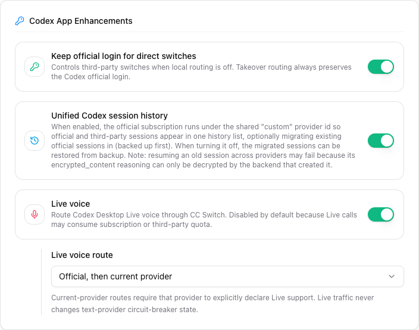
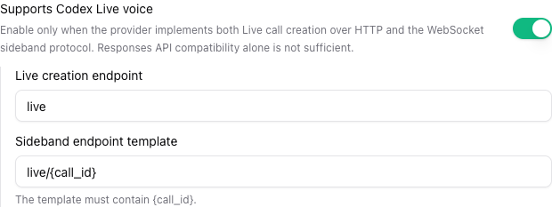

# 4.6 Codex Desktop Live Voice

## Overview

CC Switch can route the two transports used by Codex Desktop Live voice through the local proxy:

1. an HTTP request that creates the WebRTC call; and
2. a WebSocket sideband connection bound to the returned call ID.

The feature is opt-in and disabled by default. Live traffic is isolated from text-provider failover health, so a Live permission or transport error does not circuit-break a provider used for normal Codex requests.

## Support Matrix

| Route                           | Requirements                                                                                                                        | Quota used                                                                  |
| ------------------------------- | ----------------------------------------------------------------------------------------------------------------------------------- | --------------------------------------------------------------------------- |
| Official ChatGPT account        | macOS on Apple Silicon, ChatGPT OAuth, and the signed official OpenAI desktop app with DeviceCheck support                          | ChatGPT subscription                                                        |
| Current provider                | The selected provider must explicitly implement Codex Live call creation and WebSocket sideband; no OpenAI attestation is forwarded | Current provider                                                            |
| Official, then current provider | Both sets of requirements above                                                                                                     | Official quota first; current-provider quota only after an eligible failure |

The proxy implementation for a third-party provider is platform-independent, but the Codex Desktop client itself must be available on that platform. Local official attestation generation is currently macOS and Apple Silicon only.

## Prerequisites

- Start the CC Switch local proxy and enable Codex takeover.
- Keep the proxy listen address on `127.0.0.1`, `::1`, or `localhost`. Live requests are rejected when the proxy listens on `0.0.0.0` or a LAN address.
- Use Codex Desktop's Live button. Call creation must carry Codex's `x-oai-attestation` request header; browser `Origin` and `Sec-Fetch-*` requests are rejected.
- For the official route, sign in to a ChatGPT account through Codex or the CC Switch managed OAuth account store.
- For a third-party route, confirm that the upstream supports the Live protocol described below. Responses API or Chat Completions compatibility alone is not sufficient.

## Configure a Third-Party Provider

1. Open the Codex provider and expand **Advanced Options**.
2. Enable **Supports Codex Live voice**.
3. Set the call creation endpoint. The default is `live`.
4. Set the sideband endpoint template. The default is `live/{call_id}` and `{call_id}` must occur exactly once.
5. Save the provider and make it the current Codex provider when using a current-provider route.

Endpoints must be relative paths. Absolute URLs, query strings, fragments, whitespace, backslashes, and path traversal are rejected. Providers configured in Full URL mode cannot enable Live; switch the provider to a base URL first. Authentication continues to come from the provider's existing API configuration.

### Required Upstream Contract

A provider that opts in must:

- accept the Codex Live multipart call request containing `sdp` and `session` fields;
- return a successful response with a `Location` header whose final path segment is an `rtc_*` ID or UUID;
- accept a WebSocket connection at the configured sideband path after `{call_id}` substitution;
- preserve the requested WebSocket subprotocol when it selects one; and
- accept the same provider authentication on both transports.

CC Switch rewrites the successful `Location` header to the local proxy and keeps the call-to-provider binding in memory for up to 10 minutes. A successful response without a usable call ID is rejected with `502` rather than allowing the sideband connection to bypass CC Switch.

OpenAI `x-oai-attestation` is never forwarded to third-party providers. Providers that require that private proof are not supported by the third-party route.

## Choose a Route

Open **Settings > General > Codex App Enhancements**, enable **Live voice**, and choose one route:

| Setting                         | Behavior                                                                                                                                        |
| ------------------------------- | ----------------------------------------------------------------------------------------------------------------------------------------------- |
| Official ChatGPT account only   | Always creates the Live call with the built-in OpenAI Official provider and ChatGPT OAuth                                                       |
| Current provider only           | Uses only the current Codex provider and requires explicit Live capability metadata                                                             |
| Official, then current provider | Tries official first, then the current provider only for `401`, `403`, `429`, or a preflight/connect failure known not to have sent the request |

The fallback route does not retry a `5xx`, timeout, or transport failure that may already have created a call. Those outcomes are intentionally returned to Codex because retrying another provider could duplicate billing and create an orphaned call. Live does not traverse the Codex text failover queue or change provider order.

After enabling Codex takeover, restart Codex Desktop if it was already open, then use its Live button normally.

## Security and Privacy

- Live is available only on a loopback listener.
- The request `Host` must also identify loopback. Browser-originated requests are rejected, and call creation requires Codex's non-simple attestation header before CC Switch may generate a replacement proof. This prevents ordinary web pages from silently starting a billed call.
- Official attestation is generated only for the fixed built-in OpenAI Official route. Before loading the bundled DeviceCheck module, CC Switch verifies the desktop app's deep code signature, OpenAI Team ID, and bundle ID.
- Official upstream requests use a strict header allowlist before CC Switch injects ChatGPT OAuth. Client API keys, cookies, authorization, and provider-secret headers are not forwarded to OpenAI.
- Official attestation includes locale, preferred languages, timezone, screen-size summary, scale, and an ephemeral app-session ID. These values are sent to OpenAI as part of the proof.
- Third-party Live sends SDP, audio-related session data, and sideband messages to that provider. Review its billing, privacy, retention, and acceptable-use terms.
- Request and response bodies are limited to 2 MiB. WebSocket messages are limited to 8 MiB and individual frames to 2 MiB. At most 128 pending call bindings and 16 active sidebands are retained. A binding is consumed only after an upstream Sideband handshake succeeds; failed setup restores the same binding for a safe retry. Active sidebands have a five-minute idle timeout and a 20-second write timeout.
- Live errors do not increment the text-provider circuit breaker.

## Known Limitations

- Official local attestation generation currently requires macOS on Apple Silicon and a compatible signed OpenAI desktop app.
- WebSocket proxying is not yet supported. When an explicit CC Switch global outbound proxy is configured, Live call creation fails closed before contacting an upstream, so it cannot create a potentially billed HTTP call whose Sideband would bypass or fail behind that proxy.
- Only a `Location` header with an `rtc_*` ID or UUID is supported. JSON-only call IDs are rejected.
- Call bindings are in memory and are lost when CC Switch exits.
- Disabling Live or stopping the local proxy prevents new handshakes but does not yet cancel an already established Sideband. Close the Live session in Codex Desktop before disabling the feature or stopping the proxy.
- The loopback service does not have a separate per-client authentication token. The browser checks do not protect against another malicious local process that can forge HTTP headers; keep the proxy on loopback and disable Live when it is not needed.

## Troubleshooting

| Error or symptom                               | Check                                                                                                              |
| ---------------------------------------------- | ------------------------------------------------------------------------------------------------------------------ |
| `codex_live_voice_disabled`                    | Enable Live voice under Codex App Enhancements                                                                     |
| `codex_live_loopback_required`                 | Change the proxy listen address back to `127.0.0.1`, `::1`, or `localhost`                                         |
| `codex_live_client_rejected`                   | Start Live from Codex Desktop and verify the request keeps its loopback `Host` and `x-oai-attestation` header      |
| `codex_live_capacity_reached`                  | Close an unused Live session and retry; at most 16 Sideband connections may be active                              |
| `codex_live_outbound_proxy_unsupported`        | Clear the explicit global outbound proxy or wait for WebSocket proxy support before starting Live                  |
| Current provider has not declared Live support | Enable Live only after verifying that provider's HTTP and WebSocket implementation                                 |
| `codex_live_invalid_upstream_response`         | Ensure the upstream returns a valid `Location` call ID                                                             |
| Official attestation preparation failed        | Verify Apple Silicon, the installed signed OpenAI desktop app, and ChatGPT OAuth login                             |
| Sideband binding missing or expired            | Start a new Live call; bindings expire after 10 minutes and do not survive CC Switch restart                       |
| Voice connects but tools are slow              | Live transport is working; investigate the selected realtime model's tool execution and network latency separately |

Do not use the text model connectivity test as proof of Live support. The HTTP creation and WebSocket sideband must both be tested with a real Codex Desktop Live session.
