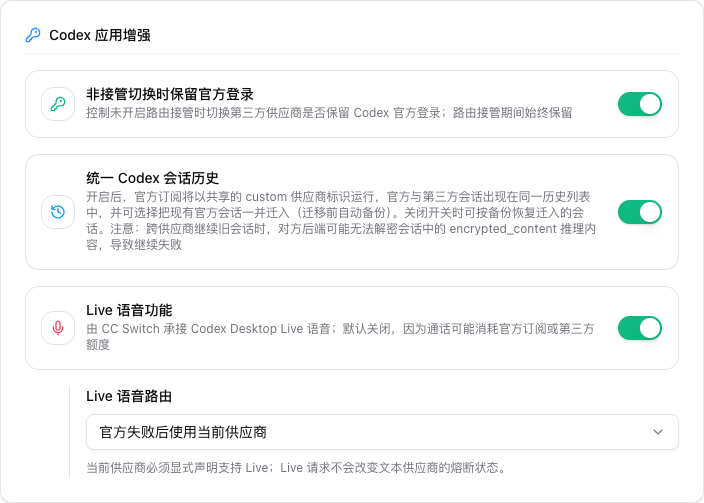
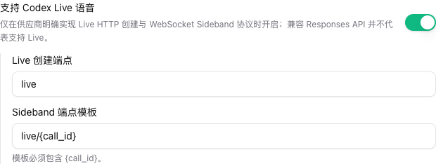

# 4.6 Codex Desktop Live 语音

## 功能说明

CC Switch 可以通过本地代理承接 Codex Desktop Live 语音使用的两段链路：

1. 创建 WebRTC 通话的 HTTP 请求；
2. 与返回的通话 ID 绑定的 WebSocket Sideband 连接。

该功能需要手动开启，默认关闭。Live 流量与文本供应商的故障转移健康状态隔离，因此 Live 权限或传输错误不会使正常 Codex 文本供应商熔断。

## 支持矩阵

| 路由                     | 前置条件                                                                                          | 消耗额度                                                 |
| ------------------------ | ------------------------------------------------------------------------------------------------- | -------------------------------------------------------- |
| ChatGPT 官方账号         | Apple Silicon Mac、ChatGPT OAuth，以及带 DeviceCheck 能力且签名有效的 OpenAI 官方桌面应用         | ChatGPT 套餐额度                                         |
| 当前供应商               | 当前供应商必须显式实现 Codex Live 创建请求和 WebSocket Sideband；不会向第三方转发 OpenAI 设备证明 | 当前供应商额度                                           |
| 官方失败后使用当前供应商 | 同时满足上述两组条件                                                                              | 优先消耗官方额度；仅在符合条件的失败后消耗当前供应商额度 |

第三方代理实现本身不限制平台，但该平台必须存在可用的 Codex Desktop 客户端。官方设备证明的本地生成目前仅支持 Apple Silicon macOS。

## 前置条件

- 启动 CC Switch 本地代理并开启 Codex 接管。
- 代理监听地址必须是 `127.0.0.1`、`::1` 或 `localhost`。监听 `0.0.0.0` 或局域网地址时会拒绝 Live 请求。
- 必须从 Codex Desktop 的 Live 按钮发起。创建通话时必须带 Codex 的 `x-oai-attestation` 请求头；带浏览器 `Origin` 或 `Sec-Fetch-*` 的请求会被拒绝。
- 使用官方路由时，需要在 Codex 或 CC Switch 托管 OAuth 账号中登录 ChatGPT。
- 使用第三方路由时，需要确认上游实现了下文协议。仅兼容 Responses API 或 Chat Completions 不代表支持 Live。

## 配置第三方供应商

1. 编辑 Codex 供应商并展开「高级选项」。
2. 开启「支持 Codex Live 语音」。
3. 填写创建端点，默认值为 `live`。
4. 填写 Sideband 端点模板，默认值为 `live/{call_id}`，且 `{call_id}` 必须仅出现一次。
5. 保存供应商；使用「当前供应商」路由时，将其设为当前 Codex 供应商。

端点必须是相对路径。绝对 URL、查询参数、片段、空白、反斜杠和路径穿越都会被拒绝。完整 URL 模式的供应商不能启用 Live，请先改为基础 URL。认证继续使用供应商已有的 API 配置。

### 上游必须实现的协议

显式开启能力的供应商必须：

- 接收包含 `sdp` 与 `session` 字段的 Codex Live multipart 创建请求；
- 成功响应必须带 `Location` 头，最后一个路径段为 `rtc_*` ID 或 UUID；
- 在替换 `{call_id}` 后的 Sideband 路径接受 WebSocket 连接；
- 如果选择了 WebSocket 子协议，必须正确回传；
- HTTP 和 WebSocket 两段链路接受同一供应商认证。

CC Switch 会把成功响应的 `Location` 改写到本地代理，并在内存中保留最长 10 分钟的「通话 ID - 供应商」绑定。成功响应没有有效通话 ID 时返回 `502`，防止 Sideband 绕过 CC Switch。

OpenAI 的 `x-oai-attestation` 不会转发给第三方供应商。必须依赖该私有证明的第三方链路不受支持。

## 选择路由

打开「设置 > 通用 > Codex 应用增强」，开启「Live 语音功能」并选择：

| 选项                     | 行为                                                                                      |
| ------------------------ | ----------------------------------------------------------------------------------------- |
| 仅使用 ChatGPT 官方账号  | 固定通过内建 OpenAI Official 供应商和 ChatGPT OAuth 创建通话                              |
| 仅使用当前供应商         | 只使用当前 Codex 供应商，且其必须显式声明 Live 能力                                       |
| 官方失败后使用当前供应商 | 先尝试官方；仅对 `401`、`403`、`429`，或确认尚未发出请求的前置检查/连接失败切换当前供应商 |

回退路由不会重试 `5xx`、可能已经创建通话的超时或不确定传输错误；这些结果会直接返回 Codex，以免切换供应商造成重复计费和孤儿通话。Live 也不会遍历 Codex 文本故障转移队列或改变供应商顺序。

开启 Codex 接管后，如果 Codex Desktop 已经运行，请重启 Codex Desktop，然后正常点击 Live 按钮。

## 安全与隐私

- Live 只允许 loopback 监听地址。
- 请求的 `Host` 也必须指向 loopback。浏览器来源请求会被拒绝；只有创建请求自带 Codex 的非简单设备证明头时，CC Switch 才可能生成替换证明，防止普通网页静默创建计费通话。
- 只有固定的内建 OpenAI Official 路由可以生成官方设备证明。加载 DeviceCheck 模块前，CC Switch 会验证桌面应用的深度代码签名、OpenAI Team ID 和 Bundle ID。
- 官方上游请求先经过严格请求头允许列表，再注入 ChatGPT OAuth；客户端 API Key、Cookie、Authorization 和供应商 Secret 不会被转发给 OpenAI。
- 官方设备证明包含语言区域、首选语言、时区、屏幕尺寸摘要、缩放比例和临时应用会话 ID，这些值会随证明发送给 OpenAI。
- 第三方 Live 会把 SDP、音频相关会话数据和 Sideband 消息发送给该供应商。请自行核对其计费、隐私、数据保留和使用条款。
- 请求和响应上限为 2 MiB；WebSocket 消息上限为 8 MiB，单帧上限为 2 MiB；最多保留 128 个待连接通话绑定和 16 个活跃 Sideband。仅在上游 Sideband 握手成功后消费绑定；建立失败会恢复同一绑定以便安全重试。活跃连接空闲 5 分钟或单次写入超过 20 秒会关闭。
- Live 错误不会增加文本供应商熔断计数。

## 已知限制

- 官方本地设备证明目前要求 Apple Silicon macOS 和兼容且签名有效的 OpenAI 官方桌面应用。
- WebSocket 代理暂未支持。显式配置 CC Switch 全局出站代理时，Live 会在连接任何上游前直接拒绝创建通话，避免先创建可能计费的 HTTP 通话后，Sideband 绕过代理或连接失败。
- 仅支持 `Location` 头中的 `rtc_*` ID 或 UUID，不支持只在 JSON 中返回通话 ID。
- 通话绑定只保存在内存中，退出 CC Switch 后会丢失。
- 关闭 Live 开关或停止本地代理会阻止新握手，但暂不会主动取消已经建立的 Sideband。请先在 Codex Desktop 中关闭 Live 会话，再关闭功能或代理。
- loopback 服务没有单独的客户端认证令牌。浏览器防护不能阻止能够伪造 HTTP 请求头的恶意本机进程；请保持本机监听，不需要时关闭 Live。

## 排障

| 错误或现象                              | 检查项                                                                          |
| --------------------------------------- | ------------------------------------------------------------------------------- |
| `codex_live_voice_disabled`             | 在 Codex 应用增强中开启 Live 语音                                               |
| `codex_live_loopback_required`          | 把监听地址改回 `127.0.0.1`、`::1` 或 `localhost`                                |
| `codex_live_client_rejected`            | 从 Codex Desktop 发起，并检查请求保留 loopback `Host` 和 `x-oai-attestation` 头 |
| `codex_live_capacity_reached`           | 关闭不用的 Live 会话后重试；最多允许 16 个活跃 Sideband                         |
| `codex_live_outbound_proxy_unsupported` | 清除显式全局出站代理，或等待 WebSocket 代理支持后再启动 Live                    |
| 当前供应商未声明 Live 支持              | 仅在确认供应商 HTTP 与 WebSocket 协议均可用后开启能力                           |
| `codex_live_invalid_upstream_response`  | 确认上游返回有效的 `Location` 通话 ID                                           |
| 官方设备证明准备失败                    | 检查 Apple Silicon、OpenAI 官方桌面应用签名和 ChatGPT OAuth 登录                |
| Sideband 绑定缺失或过期                 | 新建一次 Live 通话；绑定 10 分钟过期，CC Switch 重启后也会失效                  |
| 语音已连接但工具查询很慢                | Live 传输已工作，应另外排查实时模型的工具执行和网络延迟                         |

不要用文本模型连通性检测代替 Live 验证。必须通过真实 Codex Desktop Live 会话同时验证 HTTP 创建和 WebSocket Sideband 两段链路。
